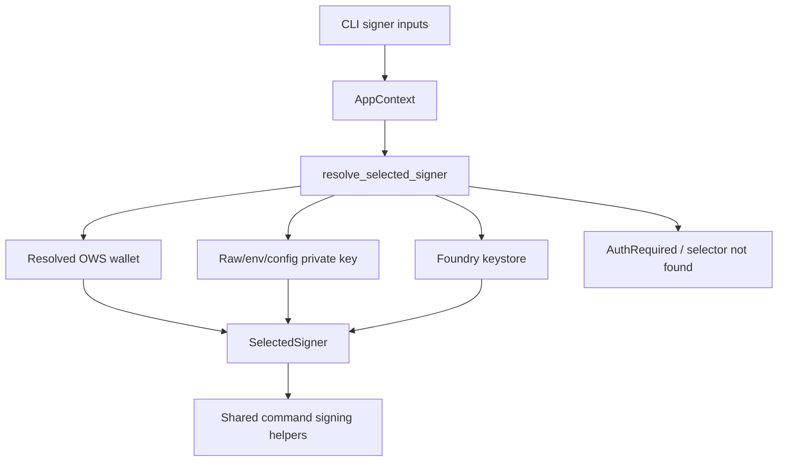

# refactor: Remove SQLite signing accounts

## Summary

Remove the legacy SQLite account-store signing path while keeping explicit raw private-key and Foundry keystore signers as supported local signer sources. The end state should make resolved OWS wallets, raw private keys, env/config private keys, and keystores use the same command signing coverage, with OWS remaining the only stored wallet lifecycle backend.

---

## Problem Frame

The CLI currently has two stored-wallet histories: OWS as the intended wallet backend and a legacy SQLite account database that can still resolve aliases and decrypt private keys. That fallback keeps old installs alive, but it muddies selector semantics, expands the secret-storage surface, and makes docs over-explain a backend that should no longer exist.

---

## Requirements

- R1. Delete the SQLite account-store implementation and all production fallback paths that read, decrypt, list, or migrate SQLite signing accounts.
- R2. Preserve explicit local signer support for `--private-key`, `HYPERLIQUID_PRIVATE_KEY`, config `private_key`, and `--keystore` plus `--keystore-password`.
- R3. Ensure local private-key and keystore signers have command signing parity with resolved OWS wallets for current live signing surfaces.
- R4. Keep OWS as the only stored wallet lifecycle backend for `wallet` and `account` management commands.
- R5. Make signer-source conflicts explicit, especially `--private-key` with `--keystore` and `--keystore-password`.
- R6. Update user-facing docs, droid-wiki docs, command metadata, and tests so SQLite stored accounts are not presented as supported behavior.
- R7. Preserve safety around plaintext secrets: no new logging, printing, or persistent storage of private keys beyond existing explicit export/generated-key exceptions.

---

## Scope Boundaries

- Do not remove raw private-key signing, env/config private-key signing, or Foundry keystore signing.
- Do not introduce a new stored local account database or new secret-storage backend.
- Do not add funded-live QA or any testnet action that submits real exchange mutations as part of this work.
- Do not remove OWS import/export lifecycle commands; private-key import into OWS remains supported.
- Do not change public account lookup semantics for literal `0x` addresses.

### Deferred to Follow-Up Work

- A dedicated user migration command for historical SQLite accounts is out of scope. Once the fallback is removed, users should re-import keys into OWS or use explicit signer flags.
- Keystore password environment/config support is out of scope unless product direction changes. This plan keeps keystore support CLI-explicit.

---

## Context & Research

### Relevant Code and Patterns

- `src/signing.rs` already centralizes backend-neutral signing in `SelectedSigner`. Local private-key and OWS backends both support modeled L1 action signing, typed-data signing, raw L1 connection-id signing, and message signing.
- `src/auth.rs` currently resolves OWS first, then raw private key, keystore, `--account`, and finally stored default signer fallback. The SQLite fallback enters through `AccountStore::open_existing_default`.
- `src/resolvers.rs` currently uses `AccountStore` for account selector lookup after OWS lookup misses. That makes aliases from deleted SQLite storage still affect public user and acting-account resolution.
- `src/commands/wallet.rs` already routes `wallet create`, `wallet import`, `account add`, `account ls`, `account set-default`, and `account remove` through OWS lifecycle operations.
- `src/db.rs` is the legacy SQLite account store and should become removable once no production module imports it.
- `tests/config_resolution.rs`, `tests/wallet_management.rs`, and command contract tests currently encode private-key config behavior, OWS account behavior, and some legacy SQLite fallback expectations.

### Institutional Learnings

- No `docs/solutions/` learnings were present in the clean worktree. The plan relies on local code patterns and repository instructions.

### External References

- No external research is needed. This is an internal refactor of existing CLI signer plumbing, not a new cryptographic or protocol integration.

---

## Key Technical Decisions

- Remove SQLite rather than deprecating it in place: The user explicitly requested deleting SQLite stuff, and OWS already owns stored wallet lifecycle.
- Keep explicit local signer flags: Raw keys and keystores are still useful for automation and recovery flows, and they already use the shared `SelectedSigner` command path.
- Treat signer parity as a regression contract: Local private-key and keystore signers should pass through the same live signing helpers as resolved OWS wallets, not branch into command-specific behavior.
- Make `--account` OWS-only: After SQLite removal, `--account` should resolve OWS wallet name/id/address semantics only, or report a clear not-found/unsupported error.
- Keep `config.private_key` compatibility for now: Removing config private-key support would be a separate user-facing breaking change from deleting SQLite stored accounts.
- Keep keystore password CLI-only: Adding env/config password support would expand the secret-handling surface and is not required for parity with OWS live signing.

---

## Open Questions

### Resolved During Planning

- Should SQLite stored accounts stay as compatibility fallback? No. The user explicitly chose deletion.
- Should legacy signers stay? Yes. Raw private-key and keystore signers remain supported and should have parity with resolved OWS wallet signing coverage.

### Deferred to Implementation

- Exact wording for missing legacy-account errors: settle while updating the affected tests and docs, but keep the behavior clear that users should use OWS import or explicit signer flags.
- Whether `src/db.rs` deletion exposes transitive dependency cleanup beyond obvious crates: decide after compilation reveals which dependencies become unused.

---

## High-Level Technical Design

> *This illustrates the intended approach and is directional guidance for review, not implementation specification. The implementing agent should treat it as context, not code to reproduce.*

The old SQLite account-store branch disappears from resolver flow. Stored wallet lifecycle stays under OWS; explicit signer flags stay as non-stored local signer inputs.

---

## Implementation Units

### U1. Remove SQLite Store From Production Signing Resolution

**Goal:** Delete the legacy SQLite fallback from signer and address resolution so production signing no longer reads `accounts.db` or decrypts stored account private keys.

**Requirements:** R1, R3, R4, R7

**Dependencies:** None

**Files:**
- Modify: `src/auth.rs`
- Modify: `src/resolvers.rs`
- Modify: `src/lib.rs`
- Delete: `src/db.rs`
- Test: `tests/wallet_management.rs`
- Test: `tests/account_command_context.rs`
- Test: `tests/positions_transfers.rs`

**Approach:**
- Remove `AccountStore` imports and fallback branches from signer resolution.
- Keep OWS selector resolution paths for explicit `--ows-signer`, `--account`, and default signer selection.
- Keep raw private-key and keystore branches intact.
- Replace stored-account fallback errors with clear OWS-oriented selector errors.
- Remove the `db` module export only after all production and test references are gone.

**Execution note:** Start with characterization changes in the tests that currently prove SQLite fallback, then remove the fallback.

**Patterns to follow:**
- OWS-first selector handling already present in `src/auth.rs`.
- Explicit selector class comments in `src/resolvers.rs`.

**Test scenarios:**
- Happy path: `--account <ows-name-or-id>` resolves an OWS wallet and signs through `SelectedSigner`.
- Error path: `--account <missing-alias>` no longer falls through to SQLite and returns a clear selector-not-found error.
- Error path: public account selector lookup no longer resolves aliases from SQLite records.
- Integration: existing OWS default wallet resolution continues to work when no explicit signer is supplied.

**Verification:**
- No production file imports `crate::db` or `AccountStore`.
- SQLite-backed private keys cannot be used as signer fallback.
- OWS and explicit local signer paths still resolve.

---

### U2. Preserve and Tighten Explicit Local Signer Sources

**Goal:** Keep raw private-key, env/config private-key, and keystore signing functional while making ambiguous local signer combinations impossible.

**Requirements:** R2, R3, R5, R7

**Dependencies:** U1 can be done before or after this unit; conflict tightening is independent.

**Files:**
- Modify: `src/main.rs`
- Modify: `src/config.rs`
- Modify: `src/auth.rs`
- Modify: `src/resolvers.rs`
- Test: `tests/config_resolution.rs`
- Test: `tests/wallet_management.rs`
- Test: `tests/cli_integration.rs`

**Approach:**
- Add clap conflicts so `--private-key` conflicts with `--keystore` and `--keystore-password`.
- Ensure `--keystore-password` requires `--keystore` or fails cleanly.
- Keep private-key resolution precedence as CLI flag, then `HYPERLIQUID_PRIVATE_KEY`, then config file.
- Keep keystore resolution explicit and CLI-only.
- Remove any branch that treats a legacy stored account as another local signer source.

**Patterns to follow:**
- Existing global flag conflict declarations in `src/main.rs`.
- Existing config-resolution tests in `tests/config_resolution.rs`.

**Test scenarios:**
- Happy path: `--private-key <key> wallet address` resolves the key-derived address.
- Happy path: `HYPERLIQUID_PRIVATE_KEY=<key> wallet address` resolves the key-derived address.
- Happy path: config `private_key` fallback still resolves when no higher-priority signer is provided.
- Happy path: `--keystore <path> --keystore-password <password>` resolves the keystore-derived address.
- Error path: `--private-key` plus `--keystore` is rejected by clap before runtime resolution.
- Error path: `--keystore-password` without `--keystore` is rejected or reported as invalid usage.
- Error path: malformed private keys still map to auth exit behavior.

**Verification:**
- Local signer sources are still present in `SignerResolverInput`.
- Ambiguous local signer combinations no longer silently prefer one secret over another.

---

### U3. Prove Local Signer and OWS Live-Signing Parity

**Goal:** Add explicit parity coverage showing local private-key, keystore, and resolved OWS signers exercise the same command signing capabilities.

**Requirements:** R2, R3, R7

**Dependencies:** U1, U2

**Files:**
- Modify: `src/signing.rs`
- Modify: `src/commands/actions.rs`
- Test: `src/signing.rs`
- Test: `tests/orders_create.rs`
- Test: `tests/orders_cancel_modify.rs`
- Test: `tests/advanced_commands.rs`
- Test: `tests/api_wallet.rs`

**Approach:**
- Keep the `SelectedSigner` abstraction as the parity boundary.
- Add focused tests around the signer methods rather than duplicating every command test for every backend.
- Cover modeled L1 action signing, typed-data signing, raw L1 connection-id signing, and message signing for local private-key and OWS wallet-backed signers.
- If a real keystore fixture is needed, create it inside an isolated temp directory during tests rather than committing secret material.

**Patterns to follow:**
- Existing OWS signing tests in `src/signing.rs` and `src/ows.rs`.
- Existing dry-run/live-submission boundaries in order and API-wallet tests.

**Test scenarios:**
- Happy path: local private-key signer can sign a modeled L1 action request with the same request fields expected from OWS.
- Happy path: OWS wallet-backed signer can sign a modeled L1 action request.
- Happy path: local private-key and OWS signers can sign user EIP-712 typed data and recover their configured addresses.
- Happy path: local private-key and OWS signers can sign raw L1 connection-id payloads.
- Happy path: local private-key and OWS signers can sign messages and recover their configured addresses.
- Happy path: keystore signer resolves into the same local private-key backend and passes at least one representative action-signing scenario.
- Error path: address-only `--ows-signer 0x...` remains blocked for live signing.

**Verification:**
- Current command signing helpers accept `SelectedSigner` only, not backend-specific signer types.
- Local private-key and keystore signers do not have command-level gaps relative to resolved OWS wallets.

---

### U4. Update Wallet and Account Command Semantics

**Goal:** Make account and wallet management commands describe and operate on OWS only, while keeping explicit signers available for single-command use.

**Requirements:** R1, R2, R4, R6, R7

**Dependencies:** U1, U2

**Files:**
- Modify: `src/commands/wallet.rs`
- Modify: `src/cli_runtime.rs`
- Modify: `src/main.rs`
- Test: `tests/wallet_management.rs`
- Test: `tests/setup_wizard.rs`
- Test: `tests/account_command_context.rs`

**Approach:**
- Remove `SignerSource::StoredAccount` display branches and legacy account terminology from wallet output.
- Keep `account add <PRIVATE_KEY>` as OWS import, not SQLite creation.
- Keep `account ls`, `account set-default`, `account remove`, `wallet list`, `wallet delete`, and `wallet rename` OWS-only.
- Ensure `wallet show` and `wallet address` still support explicit raw private-key and keystore signer inputs.
- Make missing-account messages point users to OWS import/setup or explicit signer flags, not legacy account storage.

**Patterns to follow:**
- Existing OWS lifecycle code in `src/commands/wallet.rs`.
- Existing JSON output contracts for wallet address and account list commands.

**Test scenarios:**
- Happy path: `account add <PRIVATE_KEY>` stores an OWS wallet and can set it as default.
- Happy path: `account ls` lists OWS wallets only.
- Happy path: `wallet address` works for default OWS, explicit `--private-key`, env/config private key, and keystore.
- Error path: account removal with no OWS wallets reports no stored wallets without mentioning SQLite.
- Error path: stale SQLite files in the user data directory are ignored.
- Integration: setup wizard still creates/imports OWS wallets and writes default wallet config.

**Verification:**
- Wallet/account command output no longer names or implies SQLite-backed local accounts.
- Explicit signer flags remain valid on `wallet show` and `wallet address`.

---

### U5. Remove SQLite Dependencies and Dead Secret-Storage Plumbing

**Goal:** Clean up dependencies and hardening code that exist only for the deleted SQLite account store.

**Requirements:** R1, R7

**Dependencies:** U1, U4

**Files:**
- Modify: `Cargo.toml`
- Modify: `Cargo.lock`
- Modify: `src/lib.rs`
- Modify: `src/input_hardening.rs`
- Test: `tests/security_contracts.rs`
- Test: `tests/release_artifacts.rs`

**Approach:**
- Remove direct dependencies that are only used by `src/db.rs`, such as SQLite, AES-GCM, OS keyring support, and account-store-specific base64/hash helpers when unused elsewhere.
- Keep dependencies needed by OWS, local signing, keystore signing, output, and input redaction.
- Keep input redaction for private-key and keystore-password command text, even after SQLite removal.
- Reconcile release artifact and dependency contract tests with the smaller dependency surface.

**Patterns to follow:**
- Existing dependency comments around Alloy signer versions in `Cargo.toml`.
- Existing security redaction tests in `src/input_hardening.rs` and `tests/security_contracts.rs`.

**Test scenarios:**
- Happy path: dependency contract tests no longer expect removed SQLite/keyring/account-store crates.
- Happy path: secret redaction still redacts `--private-key`, `private_key=...`, and `--keystore-password`.
- Error path: no test or production path attempts to open account encryption keys after SQLite deletion.

**Verification:**
- `src/db.rs` is gone and no removed dependency remains solely for it.
- Secret redaction continues to protect explicit signer secrets.

---

### U6. Update Command Metadata, Docs, and Generated Contracts

**Goal:** Align public docs, droid-wiki docs, command catalog metadata, and contract fixtures with OWS-only stored wallet lifecycle plus explicit local signer support.

**Requirements:** R2, R4, R5, R6

**Dependencies:** U1, U2, U4

**Files:**
- Modify: `README.md`
- Modify: `README.ja-JP.md`
- Modify: `README.zh-CN.md`
- Modify: `src/command_metadata.rs`
- Modify: `src/command_catalog.json`
- Modify: `droid-wiki/systems/signing-and-wallets.md`
- Modify: `droid-wiki/overview/architecture.md`
- Modify: `droid-wiki/reference/configuration.md`
- Modify: `droid-wiki/reference/data-models.md`
- Modify: `droid-wiki/applications/cli.md`
- Test: `tests/registry_contracts.rs`
- Test: `tests/schema_contracts.rs`
- Test: `tests/command_contracts.rs`

**Approach:**
- State that OWS is the only stored wallet backend.
- State that raw private-key and keystore signers are explicit non-stored signer sources.
- Remove docs that describe SQLite stored accounts, local-account databases, or encrypted account records as supported.
- Update signer-source conflict docs after clap conflict tightening.
- Regenerate or manually update command catalog fixtures according to the repo's established registry workflow.

**Patterns to follow:**
- Existing global options and terminology tables in `README.md`.
- Existing droid-wiki system documentation layout.
- Existing registry/schema contract tests.

**Test scenarios:**
- Happy path: registry/schema contract tests agree with updated command metadata.
- Happy path: docs describe `account add` as OWS import and not SQLite account creation.
- Happy path: docs describe signer parity between resolved OWS wallets and explicit local signers.
- Error path: no docs tell users to rely on legacy SQLite account aliases or account databases.

**Verification:**
- Search results for SQLite account-store terminology are limited to historical changelog notes if any are intentionally kept.
- README and droid-wiki agree on signer-source semantics.

---

## System-Wide Impact

- **Interaction graph:** This change affects global CLI parsing, signer resolution, account selector resolution, wallet/account lifecycle commands, signed command helpers, and docs/registry contracts.
- **Error propagation:** Missing aliases that used to fall through to SQLite should now produce OWS-oriented not-found/auth errors without masking private-key or keystore parsing errors.
- **State lifecycle risks:** Existing user SQLite account databases become ignored. The implementation should not delete user files automatically.
- **API surface parity:** All signed command families should continue to accept `SelectedSigner`, regardless of backend, with address-only OWS selectors still blocked from live signing.
- **Integration coverage:** Wallet/address resolution, order signing, API-wallet approval, transfers, staking, builder/referral, borrow/lend, and vault actions rely on common signer helpers; parity tests should cover helpers and representative command paths.
- **Unchanged invariants:** JSON output remains stable and uncolored; private keys are never logged; OWS vault lifecycle remains the stored wallet path; explicit raw keys and keystores remain available.

---

## Risks & Dependencies

| Risk | Mitigation |
|------|------------|
| Existing users with SQLite accounts lose alias-based signing | Document the breaking change and point users to `wallet import` / `account add` OWS import or explicit signer flags. |
| Removing `src/db.rs` leaves hidden dependency or test references | Treat compile/test failures as discovery for dead references; keep the removal atomic. |
| Signer parity is assumed but not proven for every command | Add method-level parity tests plus representative command tests for action families. |
| Docs drift between README, droid-wiki, and command catalog | Update all docs and registry fixtures in the same plan, then rely on schema/registry contract tests. |
| Secret-handling regression while changing signer paths | Preserve existing redaction and never introduce new persistent private-key storage. |

---

## Documentation / Operational Notes

- This is a breaking compatibility change for users who still rely on legacy SQLite account aliases.
- Release notes should explicitly say that OWS is the only stored wallet backend and legacy SQLite account stores are ignored.
- Users should be directed to re-import private keys into OWS with `wallet import` / `account add`, or use `--private-key`, `HYPERLIQUID_PRIVATE_KEY`, config `private_key`, or `--keystore` for explicit non-stored signing.
- No automatic deletion of historical SQLite files should happen during this refactor.

---

## Sources & References

- Related code: `src/auth.rs`
- Related code: `src/resolvers.rs`
- Related code: `src/signing.rs`
- Related code: `src/commands/wallet.rs`
- Related code: `src/db.rs`
- Related tests: `tests/config_resolution.rs`
- Related tests: `tests/wallet_management.rs`
- Related docs: `README.md`
- Related docs: `droid-wiki/systems/signing-and-wallets.md`
