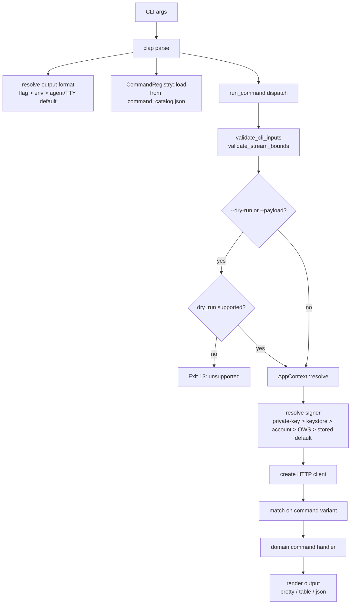

# CLI

Active contributors: Sayo, wtfsayo

The `hyperliquid` binary is the main deliverable. It is a single Rust executable that parses CLI arguments via clap derive macros and dispatches to domain-specific command handlers.

## Directory layout

```
src/
├── main.rs               # clap CLI definition, arg parsing, format resolution, main()
├── cli_runtime.rs         # Command routing, context resolution, API client setup
├── lib.rs                 # Public module exports for integration testing
├── command_registry.rs    # Typed command contracts from command_catalog.json
├── command_handlers.rs    # Handler binding metadata for command contracts
├── command_context.rs     # Per-call execution context (clients, output options)
├── command_metadata.rs    # Metadata normalization from catalog entries
├── update_check.rs        # Release update checks and self-update command
└── commands/              # 23 domain command modules
```

## Key abstractions

| Type | File | Description |
|------|------|-------------|
| `Cli` | `src/main.rs` | Top-level clap struct with global flags (format, signer, network, dry-run) |
| `Commands` | `src/main.rs` | clap subcommand enum dispatching to domain groups |
| `CommandRegistry` | `src/command_registry.rs` | In-memory typed registry loaded from `src/command_catalog.json` |
| `CommandContract` | `src/command_registry.rs` | Typed contract per command (lifecycle, risk, dry-run policy, auth, inputs) |
| `AppContext` | `src/cli_runtime.rs` | Resolved runtime context: network, signer, API URLs, HTTP clients |
| `CommandContext` | `src/command_context.rs` | Per-command execution context with output projection and transport policy |
| `UpdateResult` | `src/update_check.rs` | JSON/pretty result for `hyperliquid update` and dry-run update previews |

## How it works



## Command dispatch

The `run_command` function in `src/cli_runtime.rs` matches on each `Commands` variant and calls the corresponding handler in `src/commands/`. A few commands (wallet, local-only operations) skip API client creation. Read-only commands use `/info`; signed actions use `/exchange`.

## Entry points for modification

- **Add a new command**: define the clap variant in `src/main.rs`, add the dispatch arm in `src/cli_runtime.rs`, implement the handler in `src/commands/`, and add the contract to `src/command_catalog.json`
- **Change output behavior**: modify `src/output/mod.rs` or the `TableData` impl on the command's output struct
- **Change signer resolution**: modify `src/auth.rs`, `src/signing.rs`, or the `SignerResolverInput` flow in `src/resolvers.rs`
