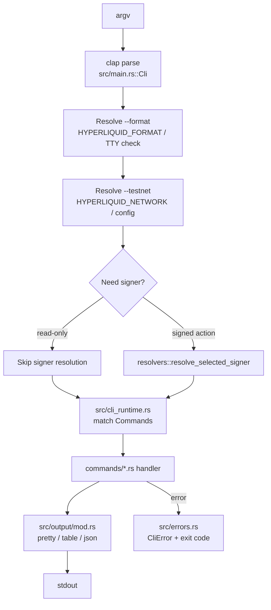

# `hyperliquid` CLI

The binary is defined in `src/main.rs` (1,079 lines) with clap derive macros. It declares a `Cli` struct with global flags, a `Commands` enum with ~25 top-level subcommands, and dispatches to per-command handlers in `src/cli_runtime.rs`.

## Dispatch flow

```mermaid
graph TD
    Argv[argv] --> Clap[clap parse<br/>src/main.rs::Cli]
    Clap --> Format[Resolve --format<br/>HYPERLIQUID_FORMAT / TTY check]
    Format --> Network[Resolve --testnet<br/>HYPERLIQUID_NETWORK / config]
    Network --> Signer{Need signer?}
    Signer -->|read-only| Skip[Skip signer resolution]
    Signer -->|signed action| Resolve[resolvers::resolve_selected_signer]
    Skip --> Dispatch
    Resolve --> Dispatch[src/cli_runtime.rs<br/>match Commands]
    Dispatch --> Handler[commands/*.rs handler]
    Handler --> Output[src/output/mod.rs<br/>pretty / table / json]
    Output --> Stdout[stdout]
    Handler -->|error| ErrPath[src/errors.rs<br/>CliError + exit code]
```

## Global flags

| Flag | Purpose |
|------|---------|
| `--format pretty\|table\|json` | Output format. Default: pretty on TTY; JSON for non-TTY or `HYPERLIQUID_AGENT=1` |
| `--private-key <HEX>` | Signer private key (overrides env/config) |
| `--keystore <PATH>` | Foundry-compatible keystore file |
| `--keystore-password <PASSWORD>` | Password for `--keystore` (prefer an interactive source in production) |
| `--account <SELECTOR>` | OWS wallet name/id/address to use as the signer |
| `--ows-signer <SELECTOR>` | OWS signer selector (`0x` address, wallet name, or id) |
| `--testnet` | Use testnet instead of mainnet |
| `--select <FIELDS>` | JSON field projection |
| `--results-only` | Strip envelope from JSON output |
| `--max-results <N>` | Cap top-level array length |
| `--dry-run` | Preview supported mutations |
| `--no-update-check` | Skip the passive update notice |
| `--payload-json <JSON>` | Raw JSON action payload (mutually exclusive with `--payload-file`) |
| `--payload-file <PATH>` | Raw JSON action payload file (`-` for stdin) |

`--private-key`, `--keystore`/`--keystore-password`, `--account`, and `--ows-signer` are mutually exclusive at parse time.

## Top-level command groups

| Group | Subcommands | Page |
|-------|-------------|------|
| Market data | `mids`, `book`, `candles`, `spread`, `funding`, `status`, `meta` | [features/market-data](../features/market-data.md) |
| Perps / Spot | `perps list/get`, `spot list/get` | [features/market-data](../features/market-data.md) |
| Outcome markets | `outcomes list/get` | [features/market-data](../features/market-data.md) |
| Asset utilities | `asset decode/search` | [features/market-data](../features/market-data.md) |
| Account | `account fills/fees/rate-limit/orders/portfolio/subaccounts/portfolio-history/ledger/funding/twap-history/twap-fills/abstraction`, `account add/ls/set-default/remove` | [features/account-and-portfolio](../features/account-and-portfolio.md) |
| API wallets | `api-wallet create/approve/list/revoke` | [features/api-wallets](../features/api-wallets.md) |
| Subaccounts | `subaccount list/create/transfer/spot-transfer` | [features/subaccounts](../features/subaccounts.md) |
| Orders | `orders create/scale/batch-create/tpsl/cancel/cancel-all/modify/twap-create/twap-cancel/schedule-cancel/open/status/history` | [features/orders](../features/orders.md) |
| Positions | `positions list/leverage/isolated-margin` | (under [features/orders](../features/orders.md)) |
| Transfers | `transfer *` | [features/transfers](../features/transfers.md) |
| Wallets | `wallet create/import/import-mnemonic/list/show/address/rename/export/delete` | [systems/signing-and-wallets](../systems/signing-and-wallets.md) |
| Staking | `staking *` | [features/staking-vaults-borrowlend](../features/staking-vaults-borrowlend.md) |
| Vaults | `vault list/get/deposit/withdraw` | [features/staking-vaults-borrowlend](../features/staking-vaults-borrowlend.md) |
| Borrow / lend | `borrowlend list/supply/withdraw` | [features/staking-vaults-borrowlend](../features/staking-vaults-borrowlend.md) |
| Builder fees | `builder max-fee/approved/approve` | [features/builder-and-referrals](../features/builder-and-referrals.md) |
| Referrals | `referral state/set/register` | [features/builder-and-referrals](../features/builder-and-referrals.md) |
| Prio | `prio *` (gossip priority auction) | (under-the-hood) |
| Schema | `schema [PATH...]` | [features/schema-discovery](../features/schema-discovery.md) |
| Setup | `setup [-y]` | [features/setup-wizard](../features/setup-wizard.md) |
| Subscribe | `subscribe trades/orderbook/candles/all-mids/orders/fills` | [systems/watch-and-streaming](../systems/watch-and-streaming.md) |
| Feedback | `feedback` | [features/feedback](../features/feedback.md) |
| Update | `update` | [systems/update-and-release](../systems/update-and-release.md) |

## Format resolution

The runtime resolves `--format` per command using these rules (in `src/main.rs` and `src/output/mod.rs`):

1. Explicit `--format` flag wins.
2. Else `HYPERLIQUID_FORMAT` env var.
3. Else pretty on a TTY; JSON if stdout is not a TTY or `HYPERLIQUID_AGENT=1`.

Format is also threaded into watch and subscribe paths so JSON streams become NDJSON.

## Entry points for modification

- To add a new top-level command, add a `Commands` variant in `src/main.rs`, an enum for its subcommands if any, a runtime arm in `src/cli_runtime.rs`, and a handler module under `src/commands/`. Register metadata in `src/command_catalog.json`.
- To change a global flag, edit `Cli` in `src/main.rs` and the propagation through `src/cli_runtime.rs`.
- The legacy clap dispatch remains the execution authority during the registry rollout; do not delete it without following `docs/registry-rollout-policy.md`.

See also: [systems/command-registry](../systems/command-registry.md), [overview/architecture](../overview/architecture.md).
