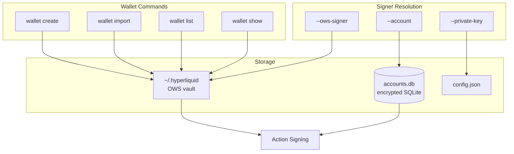

# OWS wallet backend

## Wallet lifecycle

OWS is now the **only** wallet backend for wallet lifecycle operations:

- `wallet create` creates an OWS wallet
- `wallet import` imports into the OWS vault
- `wallet list` lists OWS wallets
- `wallet show` / `wallet address` read from OWS
- `wallet delete` / `wallet rename` operate on OWS wallets

The OWS vault lives at `~/.hyperliquid` by default (overridable via `HYPERLIQUID_OWS_VAULT_PATH`).

## Signer resolution

Signing supports multiple sources:

1. Raw private key (`--private-key` or `HYPERLIQUID_PRIVATE_KEY`)
2. Foundry keystore (`--keystore`)
3. Stored encrypted account (`--account`)
4. OWS wallet (`--ows-signer`)

Only OWS is used for wallet creation and management. The other signer sources are for signing only, not for wallet lifecycle.

## Key design decisions

### `--ows-signer` as the primary signer flag

`--ows-signer` accepts wallet names, ids, or `0x` addresses. When passed a `0x` address, the CLI locates the wallet by its chain account address. This enables scripts to reference wallets by their on-chain identity.

### Chain account fallback

OWS wallets may contain accounts for multiple chains. The CLI checks for `eip155:999` (Hyperliquid chain) first, then falls back to `eip155:1` (Ethereum mainnet). This handles wallets that were created with an ETH account but later used for Hyperliquid.

### Orphaned wallet cleanup

If OWS wallet creation succeeds but config file save fails, the CLI cleans up the orphaned OWS wallet. This prevents the vault from accumulating wallets that the CLI can't reference.

### Default wallet detection

When no explicit signer is specified, the CLI auto-detects the first OWS wallet that has a Hyperliquid account. The `default_wallet_id` in `config.json` can override this.

## Architecture

