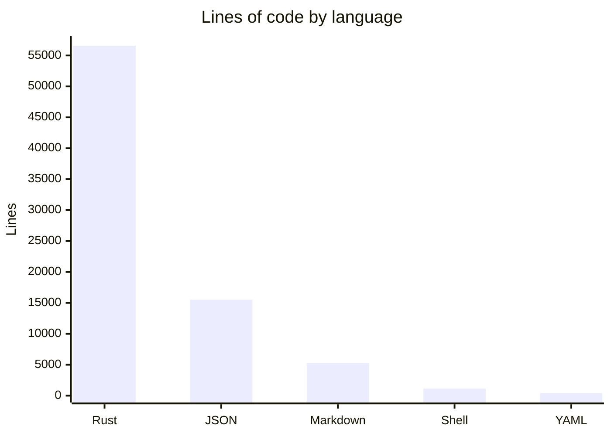

# By the numbers

Data collected on 2026-05-15 from tracked files.

## Size

Total Rust lines: **56,575** across **51 `src/` source files**, **38 Rust test files**, and `build.rs`. The tracked tree also has 4 shell scripts, 7 YAML workflow/task files, 46 Markdown files, and JSON command/contract fixtures.

| Language | Lines of code |
|----------|---------------|
| Rust | 56,575 |
| JSON | 15,509 |
| Shell | 1,144 |
| YAML | 416 |
| Markdown | 5,295 |

## Largest source files

| File | Lines | Purpose |
|------|-------|---------|
| `src/cli_runtime.rs` | 3,973 | Command dispatch and context resolution |
| `src/commands/orders.rs` | 2,477 | Order creation, validation, planning, rendering |
| `tests/orders_create.rs` | 2,188 | Order creation integration coverage |
| `src/commands/account.rs` | 1,904 | Public account data queries |
| `src/commands/orders/planning.rs` | 1,514 | Order action planning and dry-run previews |
| `src/output/mod.rs` | 1,379 | Output formatting system |
| `tests/wallet_management.rs` | 1,327 | Wallet management integration coverage |
| `src/commands/staking.rs` | 1,323 | Staking queries and actions |
| `src/db.rs` | 1,159 | Encrypted account storage |
| `tests/vaults_borrowlend.rs` | 1,145 | Vault and borrow/lend integration coverage |

## Activity (last 90 days)

Most actively changed files (Feb–May 2026):

- `src/main.rs` (75 changes) — CLI definition and arg parsing
- `src/commands/orders.rs` (43 changes) — order management
- `src/commands/wallet.rs` (33 changes) — wallet management
- `src/commands/mod.rs` (30 changes) — shared command helpers
- `README.md` (28 changes) — command surface documentation
- `src/cli_runtime.rs` (24 changes) — runtime routing and update-check integration
- `tests/orders_create.rs` (23 changes) — order creation behavior

Recent work concentrated on OWS-first wallet behavior, agent output contracts, live command follow-ups, isolated-margin validation, builder/referral defaults, and update/install behavior.

## Bot-attributed commits

Of the last 100 commits, ~44% have the co-author `capy-ai[bot]`. This is a lower bound on AI-assisted work; inline AI tools like Copilot leave no trace in git history.

## Complexity

- **Average Rust file size**: ~629 lines across tracked Rust files
- **Largest function area**: `src/cli_runtime.rs` dispatches the command tree and enforces dry-run/payload gates
- **Deepest module**: `src/commands/orders/` splits into 5 sub-modules (`args`, `planning`, `queries`, `rendering`, `validation`)
- **Exported symbols**: `src/lib.rs` exports 17 public modules for integration testing
- **Test-to-code ratio**: 51 `src/` Rust source files vs 38 Rust test files (roughly 1 test file per 1.34 source files)
