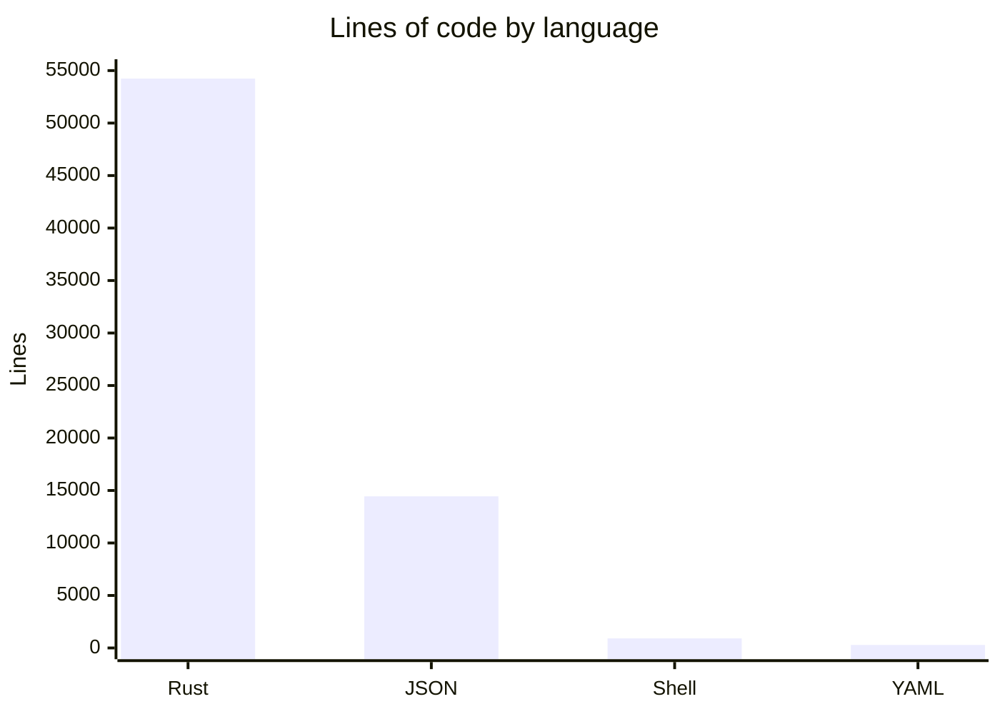

# By the numbers

Data collected on 2026-05-13.

## Size

Total Rust lines: **54,236** across **50 source files** and **37 Rust test files**. The current source tree also has 3 shell scripts, 3 workflow files, 3 docs files, and JSON command/contract fixtures.

| Language | Lines of code |
|----------|---------------|
| Rust | 54,236 |
| JSON | 14,444 |
| Shell | 914 |
| YAML | 287 |

## Largest source files

| File | Lines | Purpose |
|------|-------|---------|
| `src/cli_runtime.rs` | 3,649 | Command dispatch and context resolution |
| `src/commands/orders.rs` | 2,277 | Order creation, validation, planning, rendering |
| `tests/orders_create.rs` | 2,188 | Order creation integration coverage |
| `src/commands/account.rs` | 1,904 | Public account data queries |
| `src/commands/orders/planning.rs` | 1,495 | Order action planning and dry-run previews |
| `src/output/mod.rs` | 1,379 | Output formatting system |
| `src/commands/staking.rs` | 1,323 | Staking queries and actions |
| `src/db.rs` | 1,159 | Encrypted account storage |
| `src/commands/orderbook.rs` | 1,115 | Order book, candles, mids, and watch helpers |
| `src/commands/vaults.rs` | 1,102 | Vault discovery and transfer actions |

## Activity (last 90 days)

Most actively changed files (Feb–May 2026):

- `src/main.rs` (75 changes) — CLI definition and arg parsing
- `src/commands/orders.rs` (43 changes) — order management
- `src/commands/wallet.rs` (33 changes) — wallet management
- `src/commands/mod.rs` (30 changes) — shared command helpers
- `README.md` (28 changes) — command surface documentation
- `src/cli_runtime.rs` (24 changes) — runtime routing and update-check integration
- `tests/orders_create.rs` (23 changes) — order creation behavior

Recent work concentrated on OWS-first wallet behavior, agent output contracts, live command follow-ups, isolated-margin validation, builder/referral defaults, and update/install behavior.

## Bot-attributed commits

Of the last 100 commits, ~44% have the co-author `capy-ai[bot]`. This is a lower bound on AI-assisted work; inline AI tools like Copilot leave no trace in git history.

## Complexity

- **Average Rust file size**: ~624 lines across source and test files
- **Largest function area**: `src/cli_runtime.rs` dispatches the command tree and enforces dry-run/payload gates
- **Deepest module**: `src/commands/orders/` splits into 5 sub-modules (`args`, `planning`, `queries`, `rendering`, `validation`)
- **Exported symbols**: `src/lib.rs` exports 17 public modules for integration testing
- **Test-to-code ratio**: 50 Rust source files vs 37 Rust test files (roughly 1 test file per 1.35 source files)
