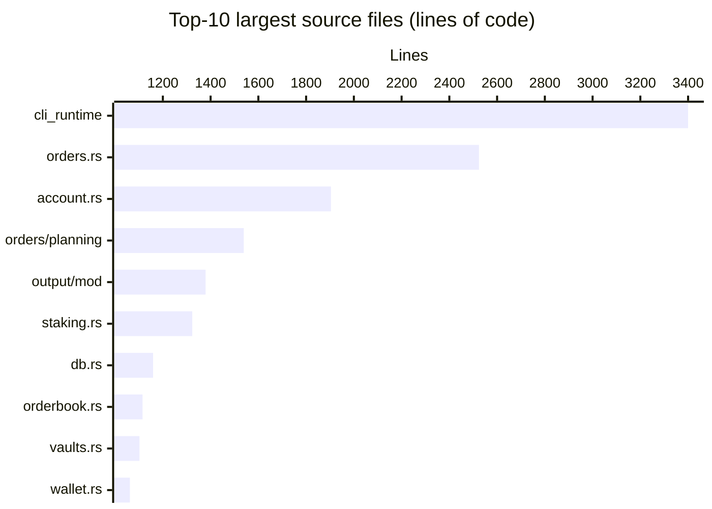

# By the numbers

Data collected on 2026-05-20.

A quantitative snapshot of the codebase as of commit `da17cb8` on the `develop` branch.

## Size

| Category | Files | Lines |
|----------|-------|-------|
| Rust source (`src/`) | 52 | 33,942 code + 1,250 comment + 3,529 blank |
| JSON command catalog (`src/command_catalog.json`) | 1 | 3,491 |
| Integration tests (`tests/`) | 39 | 19,541 |
| **Total Rust** | 52 source + 39 test | **~53,483** |

```mermaid
xychart-beta horizontal
    title "Top-10 largest source files (lines of code)"
    x-axis ["cli_runtime", "orders.rs", "account.rs", "orders/planning", "output/mod", "staking.rs", "db.rs", "orderbook.rs", "vaults.rs", "wallet.rs"]
    y-axis "Lines"
    bar [3400, 2524, 1904, 1539, 1379, 1323, 1159, 1115, 1102, 1062]
```

Largest source files:

| File | Lines |
|------|------:|
| `src/cli_runtime.rs` | ~3,400 |
| `src/commands/orders.rs` | 2,524 |
| `src/commands/account.rs` | 1,904 |
| `src/commands/orders/planning.rs` | 1,539 |
| `src/output/mod.rs` | 1,379 |
| `src/commands/staking.rs` | 1,323 |
| `src/db.rs` | 1,159 |
| `src/commands/orderbook.rs` | 1,115 |
| `src/commands/vaults.rs` | 1,102 |
| `src/commands/wallet.rs` | 1,062 |
| `src/main.rs` | 1,079 |

The embedded JSON catalog (`src/command_catalog.json`) is 3,491 lines — almost 10 % of the codebase is structured command metadata.

## Activity

| Metric | Value |
|--------|------:|
| Commits on `develop` | ~55 |
| First public release (v0.1.0) | 2026-05-15 |
| Most recent release (v0.11.0) | 2026-05-17 |
| Days between v0.1.0 and v0.11.0 | 2 |

Recent significant changes:

- **v0.11.0** (2026-05-17): Order safety hardening for `--on-behalf-of` across cancel, cancel-all, modify, TP/SL, TWAP, and scheduled cancel flows. Prompt-gated mainnet `schedule cancel-all`. Self-contained release packaging.
- **v0.1.0 → v0.11.0** dependency churn: hypersdk 0.2.10 → 0.2.11, alloy 1.8 → 2.0.4 (with v1 retained), rand 0.9.4 → 0.10.1, rpassword 7.5.1 → 7.5.2, sha2 0.10.9 → 0.11.0.
- Asset id decode and search added (`feat: add asset id decode and search`, commit `626b6f8`).

## Bot-attributed commits

| Author | Commits |
|--------|--------:|
| `dependabot[bot]` | 5 / 55 (~9 %) |

This is a lower bound on AI-assisted work — inline AI tooling leaves no trace in git history. The number reflects only dependency-bump merges that carry an explicit bot author or co-author.

## Complexity

| Metric | Value |
|--------|------:|
| Average source file size | ~653 LOC |
| Largest single file | `src/cli_runtime.rs` (~3,400 LOC) |
| Command domain modules | 23 (`src/commands/*.rs` + `src/commands/orders/` sub-tree) |
| Top-level command groups | ~25 (`Commands` enum in `src/main.rs`) |
| TODO / FIXME / HACK comments | 0 across all 52 Rust files |
| Test-to-source ratio | ~0.58 (19,541 / 33,942) |
| Direct dependencies (non-dev) | 28 |

## See also

- [overview/architecture](overview/architecture.md)
- [lore](lore.md)
- [fun-facts](fun-facts.md)
