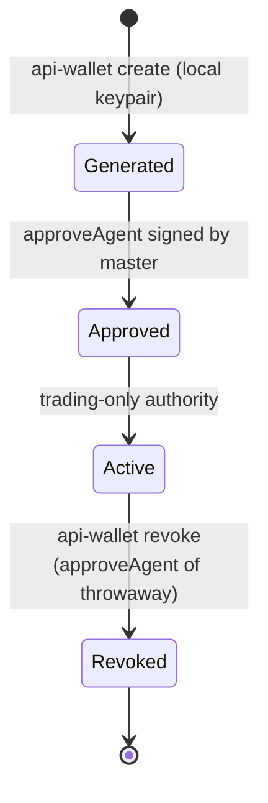

# API / agent wallets

An "API wallet" (also called an "agent wallet") is a delegated Hyperliquid trading key approved by a master account via `approveAgent`. It can trade but **cannot withdraw** — by protocol design. This is the bounded signer you hand to an AI agent or automation.

## Key file

`src/commands/api_wallet.rs`.

## Subcommands

| Command | Purpose |
|---------|---------|
| `api-wallet create [--name]` | Generate a fresh local keypair, sign `approveAgent` from the master, and print the generated private key exactly once |
| `api-wallet approve --address <ADDRESS> [--name]` | Approve an existing API wallet address with the master signer |
| `api-wallet list <MASTER_ADDRESS>` | List API wallets approved by a master |
| `api-wallet revoke --name / --address` | Revoke an API wallet (by replacing it with a short-lived throwaway agent) |

## One-time secret reveal

`api-wallet create` is the only path that prints a private key. It does so exactly once unless the command is in dry-run, in which case nothing is printed. Logs, JSON output, and any pretty rendering route the key through the standard secret-handling boundary so it never lands in a transcript except at the deliberate reveal point. Treat the printed key as you would treat any hot trading key: store it in a secret manager, do not commit it, do not log it.

## Master vs agent address

Account-data queries must use the **master or subaccount address** for the lookup target, not the API wallet address. The API wallet only signs trading actions on behalf of the master. The CLI keeps this distinction explicit:

- `api-wallet list <MASTER_ADDRESS>` — list approvals by master.
- `account portfolio <MASTER_ADDRESS>` — portfolio of master.
- `--ows-signer <AGENT_NAME>` or `HYPERLIQUID_PRIVATE_KEY=<agent key>` — sign as the agent.

## Dry-run shape

```json
{
  "command": "api-wallet create",
  "would_execute": "approve_agent",
  "args": {
    "name": "trading-agent",
    "agent_address": "0x..."
  },
  "signer": "0x... (master)",
  "acting_as": null
}
```

## Lifecycle



Revoke works by approving a short-lived throwaway agent address with the same name, effectively orphaning the previous one for that name. The revoked agent's signed actions will be rejected at the exchange.

## Entry points for modification

- To extend `api-wallet revoke` to also remove the agent from the local OWS vault, add a vault-side delete step that runs after the `approveAgent` swap succeeds.
- To add an `expires_at` field surfaced in `api-wallet list`, plumb the metadata through the API-wallet command output and the corresponding Hyperliquid info response parsing.

See also: [signing-and-wallets](../systems/signing-and-wallets.md), [security](../security.md).
