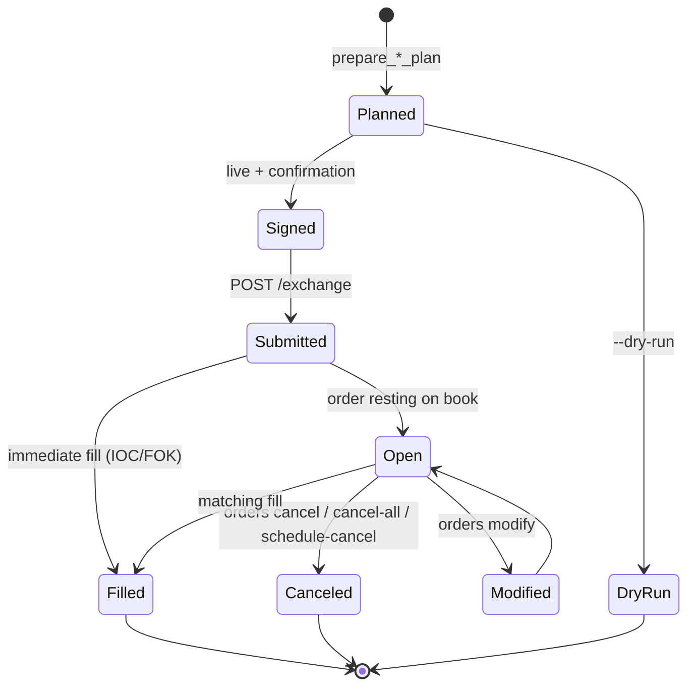

# Orders

The order family is the largest and most safety-critical surface in the CLI. Every order path supports dry-run, signs through `SelectedSigner`, and routes mainnet mutations through prompt confirmation unless `-y` is passed deliberately.

## Key files

| File | Purpose |
|------|---------|
| `src/commands/orders.rs` | Top-level dispatch (~2,524 lines): create, scale, batch-create, tpsl, cancel, cancel-all, modify, twap, schedule-cancel, open, status, history |
| `src/commands/orders/args.rs` | All clap `Args` structs |
| `src/commands/orders/planning.rs` | `prepare_*_plan` functions: build typed actions, dry-run envelopes, and submission payloads |
| `src/commands/orders/validation.rs` | Tick-size and lot-size checks, leverage caps, asset-DEX cross-checks |
| `src/commands/orders/rendering.rs` | Pretty/table/JSON formatters for fills, opens, history |
| `src/commands/orders/queries.rs` | Public order status (`info` queries) |

## Subcommands

| Command | Purpose | Dry-run | Confirmation |
|---------|---------|---------|--------------|
| `orders create` | Single order (limit, market, stop, take-profit, stop-limit, take-limit, TWAP via separate command) | supported | required on live mainnet unless `-y` |
| `orders scale` | Deterministic ladder of limit orders | supported | required unless `-y` |
| `orders batch-create` | Submit a JSON batch (max 500) | supported | required unless `-y` |
| `orders tpsl` | Position-attached TP/SL pair | supported | required unless `-y` |
| `orders cancel <OID>` | Cancel one order by OID | supported | not required; `-y` is **not** accepted |
| `orders cancel-all` | Cancel all open orders (optionally filtered by coin) | supported | required unless `-y` |
| `orders modify` | Modify an existing order | supported | required unless `-y` |
| `orders twap-create` | Time-weighted-average-price slice schedule | supported | required unless `-y` |
| `orders twap-cancel` | Cancel an active TWAP | supported | required unless `-y` |
| `orders schedule-cancel` | Server-side dead-man's switch (sets a ScheduleCancel action) | supported | prompt-gated on mainnet unless `-y`. See safety note below |
| `orders open` | List open orders (read-only) | n/a | n/a |
| `orders status` | Public OID/CLOID status (read-only) | n/a | n/a |
| `orders history` | Order history (read-only) | n/a | n/a |

## Order types and TIF

`OrderType` includes `Limit`, `TpSl`, and `Trigger`. The placement is selected through `OrderTypePlacement` and the time-in-force is one of:

- `Alo` — add-liquidity-only (post-only).
- `Gtc` — good-til-canceled.
- `Ioc` — immediate-or-cancel.
- `Fok` — fill-or-kill (where supported).

Market orders use `--type market` with `--amount` (quote/collateral unit) and a `--max-slippage-bps` cap. Default slippage is `DEFAULT_MARKET_ORDER_SLIPPAGE_BPS = 500` (5%), clamped between 1 and 1000 bps. Reduce-only is set with `--reduce-only`. Client order IDs can be supplied with `--cloid`.

## Dry-run shape

`prepare_create_order_plan` builds a `DryRunEnvelope` whose `details` JSON includes:

```json
{
  "would_execute": "create_order",
  "asset_id": 0,
  "resolved_asset": "BTC",
  "amount": "0.001",
  "amount_unit": "BTC",
  "limit_px": "50000",
  "size": "0.001",
  "margin_mode": "cross",
  "reduce_only": false,
  "tif": "alo",
  "cloid": null,
  "signer": "0x...",
  "acting_as": null,
  "vault_address": null
}
```

For market orders, `amount_unit` reflects the quote/collateral token (e.g., `"USDC"`, `"USDH"`, `"BTC"` for spot reverses). Agents should always assert on `amount_unit` before sending live to avoid base-vs-quote confusion.

## Acting-account safety (v0.11.0)

`--on-behalf-of <ADDRESS>` was hardened across the entire order lifecycle in v0.11.0 (PR #14, commit `3440982`). The fix carries the acting-account selector into:

- order lookups (so `cancel`, `modify`, and `tpsl` resolve the right open-orders set),
- dry-run previews (so `vault_address` is captured in the envelope), and
- live `vaultAddress` submission (so the signed action targets the correct subaccount/vault).

Without this plumbing, a user signing for a master while cancelling on a subaccount would have submitted a cancel that found nothing or, worse, hit the wrong account. The hardening covers `cancel`, `cancel-all`, `modify`, `tpsl`, `twap-create`, `twap-cancel`, and `schedule-cancel`.

The selector class itself is documented separately: `--on-behalf-of` accepts a stored subaccount/vault context for that signed action, but it does **not** imply local-alias resolution for transfer recipients or other `*_ADDRESS` fields. See [overview/glossary](../overview/glossary.md).

## Mainnet schedule cancel-all

v0.11.0 also added prompt-gated safety for the mainnet `schedule cancel-all` flavor (commit `3440982`). The default is to prompt for confirmation even when the schedule is intentionally automation-driven; pass `-y` to bypass when you really mean it.

## Lifecycle (state machine)



## Batch limits

```rust
const MAX_BATCH_ORDER_COUNT: usize = 500;
```

`orders batch-create` reads a JSON file via [input hardening](../systems/input-hardening.md), validates against the per-order schema, and rejects batches over 500. Partial successes are reported with exit code 15 (`PartialResults`).

## Entry points for modification

- To add a new order type, extend `OrderType` in `hypersdk` (or wrap it) and add an `args.rs` flag plus a `planning.rs` planner that returns the correct typed `Action`.
- To change market-order slippage defaults, edit the constants near the top of `src/commands/orders.rs` and update the corresponding schema/test fixtures.
- To extend acting-account safety to a new mutating order command, mirror the `--on-behalf-of` plumbing pattern from `cancel`/`modify` in `planning.rs` and add coverage in `tests/orders_cancel_modify.rs` / `tests/orders_list_twap.rs`.

See also: [dry-run](dry-run.md), [agent-output-contract](agent-output-contract.md), [account-and-portfolio](account-and-portfolio.md).
