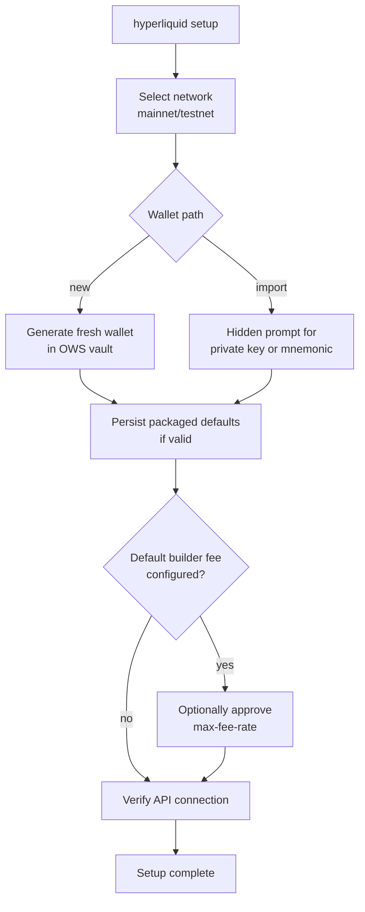

# Setup wizard

`hyperliquid setup` is the guided first-time onboarding for human operators. `setup -y` is the unattended variant for distribution environments.

## Key file

`src/commands/setup.rs` (~559 lines).

## Interactive flow



Highlights:

- Secrets entered at hidden prompts are never echoed or logged.
- The wizard validates packaged defaults (`HYPERLIQUID_DEFAULT_BUILDER_ADDRESS`, `HYPERLIQUID_DEFAULT_BUILDER_FEE_RATE`, `HYPERLIQUID_DEFAULT_REFERRAL_CODE`) before wallet creation. Invalid or partial builder defaults fail setup so the operator can fix distribution config.
- After wallet creation the wizard verifies the selected Hyperliquid API endpoint with a `status` call.

## Unattended (`-y`)

```bash
hyperliquid setup -y
```

- Creates a fresh OWS wallet (no prompts).
- Accepts packaged defaults.
- Tolerates builder approval failures so a broken default builder doesn't block setup (commit `2bf73af`, "fix(setup): tolerate builder approval failures"). The failure surfaces later when the user actually invokes a builder command.

## What the wizard does not do

- It does not export the generated private key. To export, use `wallet export <SELECTOR>` after setup.
- It does not change the OWS vault path; respect `HYPERLIQUID_OWS_VAULT_PATH` if set before running.

## Direct wallet primitives

For finer control, skip the wizard and call the primitives directly:

```bash
hyperliquid wallet create
hyperliquid wallet import
hyperliquid wallet import-mnemonic
```

Each one persists packaged defaults opportunistically (only when fully valid) and selects the resulting wallet as default. Invalid or partial defaults are skipped without blocking wallet provisioning.

## Entry points for modification

- To add a new step (e.g., default referral approval), extend `SetupArgs` and the step list in `src/commands/setup.rs`. Add a corresponding non-interactive default for `-y`.
- To change packaged-default validation rules, edit `build.rs` and the validator in `setup.rs`. Make sure setup error messages route through [error-and-output](../systems/error-and-output.md) sanitization.

See also: [builder-and-referrals](builder-and-referrals.md), [signing-and-wallets](../systems/signing-and-wallets.md).
