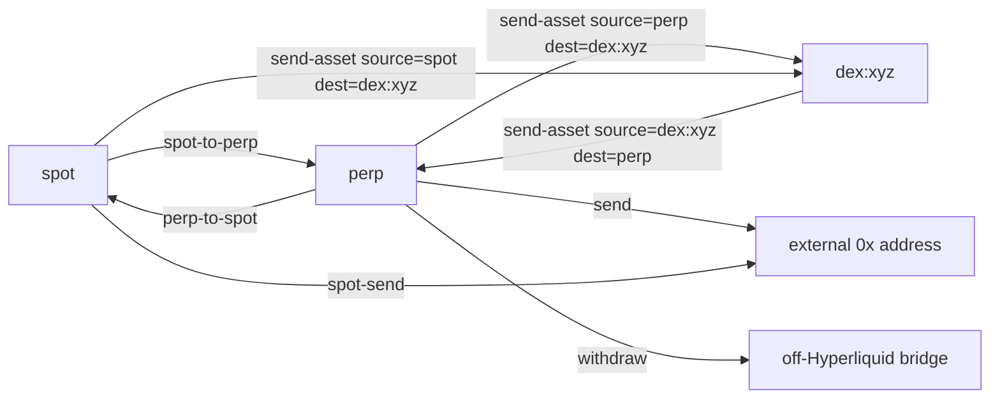

# Transfers

`transfer` covers funds movement between an account's contexts and to external recipients. Every variant supports `--dry-run` and prompt-gates live mainnet mutations.

## Key file

`src/commands/transfers.rs` (~950 lines).

## Subcommands

| Command | Purpose |
|---------|---------|
| `transfer spot-to-perp --amount` | Move USDC from spot to perp margin |
| `transfer perp-to-spot --amount` | Move USDC from perp to spot |
| `transfer send --to <ADDR> --amount` | USDC send to another protocol address |
| `transfer spot-send --to <ADDR> --token --amount` | Send a spot token |
| `transfer send-asset --to <USER_ADDRESS> --source <ctx> --dest <ctx> --token --amount` | Cross-context send (perp ↔ spot ↔ `dex:<DEX>`) |
| `transfer withdraw --amount` | USDC withdrawal off Hyperliquid |

`--source` and `--dest` accept `perp`, `spot`, or `dex:<DEX>` (HIP-3 DEX context). The `dex:` prefix is required to address a HIP-3 DEX's margin domain.

## Selector rules

- `--to` is a **protocol address** (`*_ADDRESS`). Wallet names and aliases are not resolved here. See [overview/glossary](../overview/glossary.md).
- Self-transfer is rejected for `transfer send` and `transfer spot-send` to avoid no-op calls.
- `transfer send-asset --to USER_ADDRESS` allows the user's own address; that flow is for moving funds between contexts the user controls.

## Dry-run shape

```json
{
  "command": "transfer send-asset",
  "would_execute": "transfer_send_asset",
  "args": {
    "to": "0x...",
    "source": "perp",
    "dest": "dex:xyz",
    "token": "USDC",
    "amount": "20"
  },
  "signer": "0x...",
  "acting_as": null,
  "vault_address": null
}
```

## Cross-context routing



## Entry points for modification

- To add a new context (e.g., a new builder-managed margin domain), extend the `--source`/`--dest` parser in `src/commands/transfers.rs` and the underlying `usd_class_transfer` planning helpers.
- To soften the self-transfer rejection (e.g., for a future intra-account use case), gate it behind an explicit flag rather than removing the check.

See also: [subaccounts](subaccounts.md), [agent-output-contract](agent-output-contract.md).
