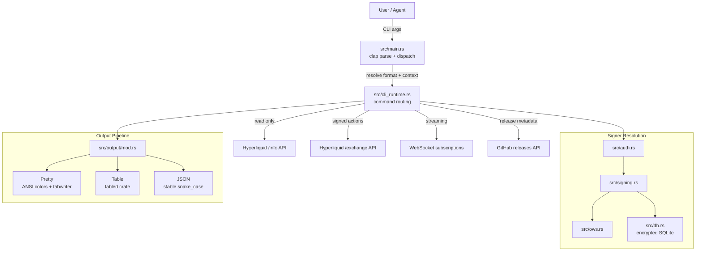
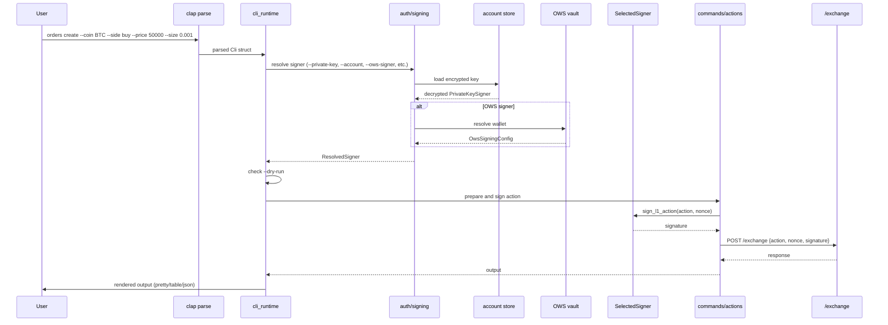

# Architecture

## System overview

`hyperliquid-cli` is a single Rust binary with a clap-based command parser that dispatches to modular command handlers. The binary talks to Hyperliquid's HTTP API (`/info` and `/exchange` endpoints), WebSocket streams, and GitHub release metadata for its update workflow.

## Component map

| Component | File(s) | Role |
|-----------|---------|------|
| Entry point | `src/main.rs` | Clap CLI definition, argument parsing, format resolution, error routing |
| Command dispatch | `src/cli_runtime.rs` | Per-command routing, context resolution, API client creation, dry-run gating |
| Command registry | `src/command_registry.rs` | Typed command contracts loaded from `src/command_catalog.json` |
| Command handlers | `src/commands/` | 23 domain modules implementing all ~45 commands |
| Output system | `src/output/mod.rs` | Pretty/table/JSON rendering, color theme, JSON projection |
| Error system | `src/errors.rs` | Structured `CliError` variants with exit codes 0-15 |
| Auth/signing | `src/auth.rs`, `src/signing.rs`, `src/resolvers.rs` | Signer resolution from private keys, keystores, stored accounts, or OWS |
| OWS wallet backend | `src/ows.rs` | Open Wallet Standard vault at `~/.hyperliquid` |
| Account storage | `src/db.rs` | SQLite with AES-256-GCM encrypted private keys |
| Config | `src/config.rs` | Config file, env vars, network selection |
| Dry-run | `src/dry_run.rs` | Action plan previews for mutating commands |
| Watch/streaming | `src/watch.rs` | Terminal watch mode (alternate screen) and WebSocket subscription helpers |
| Update checks | `src/update_check.rs`, `install.sh` | Best-effort release notices and self-update/install archive verification |
| Input hardening | `src/input_hardening.rs` | Path traversal prevention, JSON size/depth limits |
| Response sanitization | `src/response_sanitization.rs` | Strips ANSI/control sequences from untrusted remote text |
| HTTP helpers | `src/http_api.rs` | Shared reqwest client, POST helpers, error mapping |

## Data flow: signed action

## Key dependencies

- **hypersdk** — Hyperliquid API types, signing, WebSocket client
- **clap** — CLI argument parsing with derive macros
- **tokio** — async runtime
- **alloy** — Ethereum signing, EIP-712 typed data, keystore support
- **rusqlite** — encrypted local account storage
- **ows-lib** — Open Wallet Standard integration
- **rust_decimal** — financial precision for prices and amounts

## Current command surface

The command surface is catalog-driven from `src/command_catalog.json`; `src/command_registry.rs` loads that embedded catalog and emits schemas through `src/commands/schema.rs`. Builder approval, referral defaults, OWS-first wallet resolution, isolated-margin validation, and the release update path are part of the main CLI runtime.
