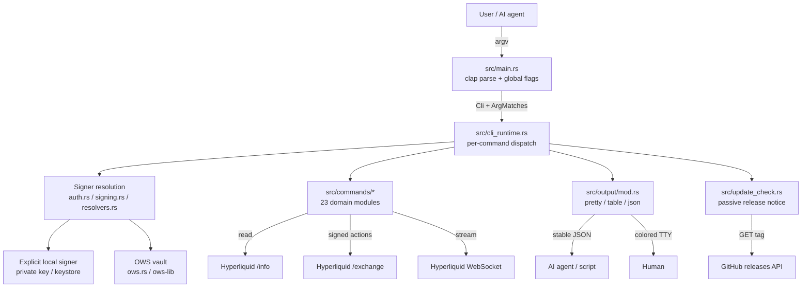
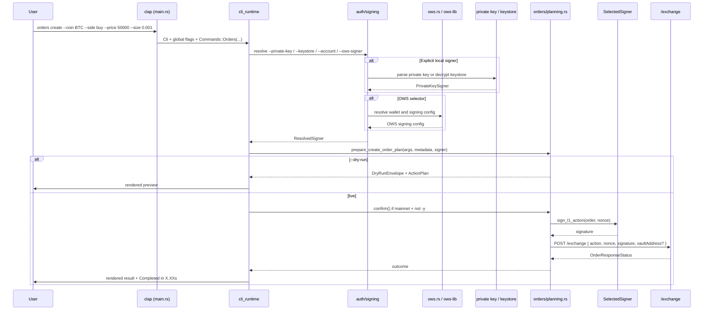
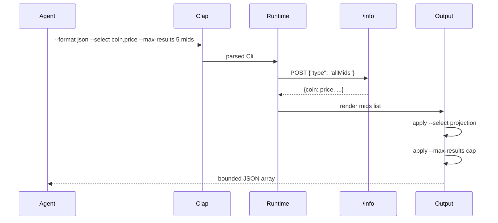
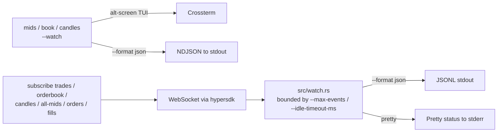

# Architecture

`hyperliquid-cli` is one Rust binary. Clap parses arguments in `src/main.rs`, a per-command runtime in `src/cli_runtime.rs` resolves output format, signer, and dry-run context, and command handlers in `src/commands/` perform the work against Hyperliquid's HTTP `/info` and `/exchange` endpoints, its WebSocket stream, and (for self-update) the GitHub releases API.

## System overview

```mermaid
graph TD
    User[User / AI agent] -->|argv| Main[src/main.rs<br/>clap parse + global flags]
    Main -->|Cli + ArgMatches| Runtime[src/cli_runtime.rs<br/>per-command dispatch]
    Runtime --> Auth[Signer resolution<br/>auth.rs / signing.rs / resolvers.rs]
    Runtime --> Cmd[src/commands/*<br/>23 domain modules]
    Runtime --> Output[src/output/mod.rs<br/>pretty / table / json]
    Runtime --> Update[src/update_check.rs<br/>passive release notice]

    Auth --> Local[Explicit local signer<br/>private key / keystore]
    Auth --> Ows[OWS vault<br/>ows.rs / ows-lib]

    Cmd -->|read| Info[Hyperliquid /info]
    Cmd -->|signed actions| Exch[Hyperliquid /exchange]
    Cmd -->|stream| Ws[Hyperliquid WebSocket]
    Update -->|GET tag| GH[GitHub releases API]

    Output -->|stable JSON| Agent[AI agent / script]
    Output -->|colored TTY| Human[Human]
```

## Component map

| Component | File(s) | Role |
|-----------|---------|------|
| Entry point | `src/main.rs` (1,079 lines) | Clap CLI definition, global flag declarations, raw payload routing, format resolution |
| Command runtime | `src/cli_runtime.rs` (~3,400 lines) | Per-command dispatch, network and client construction, dry-run gating, signer plumbing |
| Embedded catalog | `src/command_catalog.json` | Editable source of command metadata (risk, dry-run policy, raw payload policy, confirmation) |
| Command registry | `src/command_registry.rs`, `src/command_metadata.rs` | Typed `CommandContract` loaded from the catalog; emits schema for agents |
| Command handlers | `src/commands/` | 23 domain modules + the `orders/` planning/rendering/validation sub-tree |
| Output system | `src/output/mod.rs` (1,379 lines) | `OutputFormat` enum, JSON projection, ANSI colors, error routing |
| Error system | `src/errors.rs` (738 lines) | `CliError` variants with structured exit codes |
| Auth / signing | `src/auth.rs`, `src/signing.rs`, `src/resolvers.rs` | Resolves a `SelectedSigner` from private key, keystore, or OWS selector |
| OWS wallet backend | `src/ows.rs` (963 lines) | Vault path discovery, wallet selection, EIP-712 signing through `ows-lib` |
| Config | `src/config.rs` (874 lines) | Config file, env vars, network selection, packaged defaults |
| Dry-run envelope | `src/dry_run.rs` | `ActionPlan`, `DryRunEnvelope`, signing context capture |
| Watch / streaming | `src/watch.rs` (897 lines) | Alternate-screen snapshot watch mode and bounded WebSocket subscriptions |
| Update check / self-update | `src/update_check.rs` (585 lines), `install.sh` | Passive release notices, foreground update flow with SHA-256 verification |
| Input hardening | `src/input_hardening.rs` | Path traversal prevention, JSON file size/depth limits |
| Response sanitization | `src/response_sanitization.rs` | Strips ANSI/control sequences from untrusted remote text and tags it as `[untrusted remote data]` |
| HTTP helpers | `src/http_api.rs` | Shared `reqwest` POST helpers for `/info` |
| Build script | `build.rs` | Embeds packaged builder and referral defaults at compile time |

## Data flow — signed action

```mermaid
sequenceDiagram
    participant User
    participant Clap as clap (main.rs)
    participant Runtime as cli_runtime
    participant Auth as auth/signing
    participant Ows as ows.rs / ows-lib
    participant Local as private key / keystore
    participant Plan as orders/planning.rs
    participant Sign as SelectedSigner
    participant API as /exchange

    User->>Clap: orders create --coin BTC --side buy --price 50000 --size 0.001
    Clap->>Runtime: Cli + global flags + Commands::Orders(...)
    Runtime->>Auth: resolve --private-key / --keystore / --account / --ows-signer
    alt Explicit local signer
        Auth->>Local: parse private key or decrypt keystore
        Local-->>Auth: PrivateKeySigner
    end
    alt OWS selector
        Auth->>Ows: resolve wallet and signing config
        Ows-->>Auth: OWS signing config
    end
    Auth-->>Runtime: ResolvedSigner
    Runtime->>Plan: prepare_create_order_plan(args, metadata, signer)
    alt --dry-run
        Plan-->>Runtime: DryRunEnvelope + ActionPlan
        Runtime->>User: rendered preview
    else live
        Runtime->>Plan: confirm() if mainnet + not -y
        Plan->>Sign: sign_l1_action(order, nonce)
        Sign-->>Plan: signature
        Plan->>API: POST /exchange { action, nonce, signature, vaultAddress? }
        API-->>Plan: OrderResponseStatus
        Plan-->>Runtime: outcome
        Runtime->>User: rendered result + Completed in X.XXs
    end
```

## Data flow — read-only query with agent output

```mermaid
sequenceDiagram
    participant Agent
    participant Clap
    participant Runtime
    participant Info as /info
    participant Output

    Agent->>Clap: --format json --select coin,price --max-results 5 mids
    Clap->>Runtime: parsed Cli
    Runtime->>Info: POST {"type": "allMids"}
    Info-->>Runtime: {coin: price, ...}
    Runtime->>Output: render mids list
    Output->>Output: apply --select projection
    Output->>Output: apply --max-results cap
    Output-->>Agent: bounded JSON array
```

## Streaming and watch

```mermaid
graph LR
    SnapshotCmd[mids / book / candles<br/>--watch] -->|alt-screen TUI| Crossterm
    SnapshotCmd -->|--format json| NdJson[NDJSON to stdout]
    SubscribeCmd[subscribe trades / orderbook /<br/>candles / all-mids / orders / fills] --> Ws[WebSocket via hypersdk]
    Ws --> Watch[src/watch.rs<br/>bounded by --max-events / --idle-timeout-ms]
    Watch -->|--format json| JsonStdout[JSONL stdout]
    Watch -->|pretty| Stderr[Pretty status to stderr]
```

The watch helpers enforce upper bounds with `HYPERLIQUID_WATCH_MAX_TICKS`, `--max-events`, and `--idle-timeout-ms` so agent callers never wait forever for a stream.

## Key dependencies

- **[`hypersdk`](https://github.com/infinitefield/hypersdk) 0.2** — Hyperliquid API types, signing helpers, WebSocket subscription client. Re-exports Alloy 1.x signer types.
- **`clap` 4** — derive-macro CLI parsing.
- **`tokio` 1** — async runtime with multi-thread, process, time, and io-util features.
- **`alloy` 2.0.4** (+ `alloy-v1` 1.8 alias) — Ethereum signing and EIP-712 typed data. Both versions coexist because hypersdk pins Alloy 1's `PrivateKeySigner`; see [signer compatibility](../background/design-decisions.md).
- **`rust_decimal` 1** — `Decimal` for every price, size, and amount.
- **`ows-lib` 1.3.2** — Open Wallet Standard vault, EIP-712 signing through the OWS protocol.
- **`reqwest` 0.13**, **`tabled` 0.20**, **`tabwriter` 1**, **`crossterm` 0.29**.

## Command surface

The surface is catalog-driven from `src/command_catalog.json` (3,491 JSON lines). `CommandRegistry::from_embedded_catalog()` deserializes it into typed `CommandContract` records, and `src/commands/schema.rs` renders them for the `hyperliquid schema` subcommand. The legacy clap dispatch in `src/main.rs` remains the execution authority while command-family migrations move handlers behind typed registry routes (see [command registry](../systems/command-registry.md) and [docs/registry-rollout-policy.md](https://github.com/hypurrclaw/hyperliquid-cli/blob/main/docs/registry-rollout-policy.md)).
