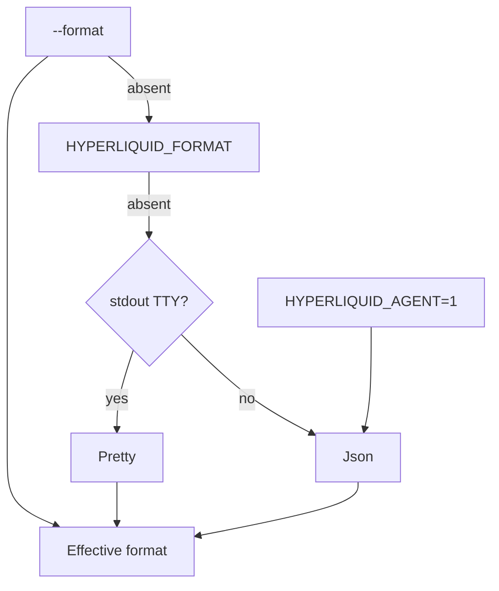

# Configuration

The CLI reads configuration from three sources, in order:

1. CLI flags (`--private-key`, `--testnet`, `--format`, etc.)
2. Environment variables
3. Config file `~/.config/hyperliquid/config.json`

A missing config file is not an error for read-only commands. The file is only created by `hyperliquid setup` or by `wallet create / import / import-mnemonic`.

## Environment variables

| Variable | Used by | Purpose |
|----------|---------|---------|
| `HYPERLIQUID_PRIVATE_KEY` | `src/config.rs` | Signer private key (least secure; prefer OWS) |
| `HYPERLIQUID_NETWORK` | `src/config.rs` | `mainnet` or `testnet` |
| `HYPERLIQUID_API_BASE_URL` | `src/config.rs` | Override both mainnet and testnet base URL |
| `HYPERLIQUID_MAINNET_API_BASE_URL` | `src/config.rs` | Override mainnet base URL |
| `HYPERLIQUID_TESTNET_API_BASE_URL` | `src/config.rs` | Override testnet base URL |
| `HYPERLIQUID_FORMAT` | `src/output/mod.rs` | Default output format (`pretty`/`table`/`json`) |
| `HYPERLIQUID_AGENT` | `src/output/mod.rs`, `src/update_check.rs` | When `=1`, default to JSON and suppress prompts/update notices |
| `HYPERLIQUID_NO_UPDATE_CHECK` | `src/update_check.rs` | Disable passive update notices |
| `HYPERLIQUID_WATCH_MAX_TICKS` | `src/watch.rs` | Cap snapshot watch ticks |
| `HYPERLIQUID_SUBSCRIBE_MAX_EVENTS` | `src/watch.rs`, `src/cli_runtime.rs` | Cap subscribe stream events (env-level bound for `--max-events`) |
| `HYPERLIQUID_OWS_VAULT_PATH` | `src/ows.rs` | Override OWS vault path (default `~/.hyperliquid`) |
| `OWS_PASSPHRASE` | `src/ows.rs` | Unattended unlock passphrase for the OWS vault |
| `HYPERLIQUID_DEFAULT_BUILDER_ADDRESS` | `build.rs`, `src/commands/setup.rs` | Runtime override of packaged default builder address |
| `HYPERLIQUID_DEFAULT_BUILDER_FEE_RATE` | `build.rs`, `src/commands/setup.rs` | Runtime override of packaged default builder fee rate |
| `HYPERLIQUID_DEFAULT_REFERRAL_CODE` | `build.rs`, `src/commands/setup.rs` | Runtime override of packaged default referral code |
| `HYPERLIQUID_UPDATE_CONTRACTS` | tests | When `=1`, regenerate characterization fixtures |
| `HL_ENABLE_FUNDED_LIVE_QA` | QA scripts | Opt-in for funded-live QA actions |
| `HL_BIN` | `scripts/qa-command-matrix.sh` | Binary path to test |
| `HL_QA_STRICT_SKIPS` | QA scripts | Fail on intentionally skipped commands |

## Config file

`~/.config/hyperliquid/config.json`. All fields optional.

```json
{
  "private_key": "0x...",            // discouraged; prefer OWS
  "network": "mainnet",
  "default_ows_wallet": "alice",
  "default_account": "alice",
  "default_builder_address": "0x...",
  "default_builder_fee_rate": "0.001",
  "default_referral_code": "ABC123"
}
```

The exact schema is defined in `src/config.rs::Config`. Fields are filled from env and CLI overrides as needed.

## Vault and storage paths

| Path | Purpose |
|------|---------|
| `~/.hyperliquid` (or `HYPERLIQUID_OWS_VAULT_PATH`) | OWS vault directory |
| `~/.config/hyperliquid/config.json` | CLI config |
| `~/.config/hyperliquid/version.json` | Update-check cache |

## Format precedence



## See also

- [systems/signing-and-wallets](../systems/signing-and-wallets.md)
- [features/agent-output-contract](../features/agent-output-contract.md)
- [security](../security.md)
