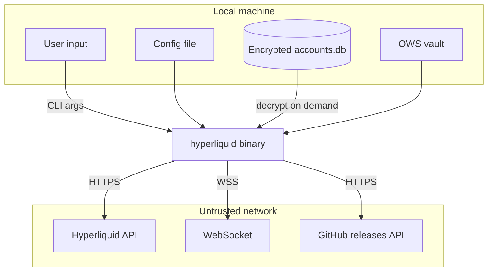

# Security

## Trust boundaries

## Key security properties

### Private key handling

- Private keys are never logged, committed, or stored in plaintext; `api-wallet create` prints a newly generated API private key exactly once unless the command is only dry-run
- `wallet import` and `account add` use hidden prompts when no argument is passed to avoid shell history exposure
- Config file storage of private keys is supported for backward compatibility but stored accounts are preferred

### Encryption at rest

- Account private keys in `accounts.db` are encrypted with AES-256-GCM before insertion
- The data encryption key is stored in the OS keychain (macOS Keychain, Linux Secret Service, Windows Credential Manager)
- In headless environments, `HYPERLIQUID_ACCOUNT_KEY_PASSPHRASE` provides deterministic key derivation via SHA-256
- OWS wallets use the OWS vault's own encryption

### Input hardening

`src/input_hardening.rs` validates all agent-supplied identifiers and file paths:

- Resource IDs cannot contain control characters, path traversal (`../`, `..\\`), or percent-encoded traversal (`%2e`, `%2f`, `%5c`)
- JSON file inputs are limited to 1MB, max depth 64, max 4096 keys, max 64KB per string
- File paths are validated against a `FilePolicy` (label, stdin allowance, max bytes)

### Response sanitization

`src/response_sanitization.rs` strips ANSI escape sequences and control characters from all untrusted remote text surfaced in errors. All such text is prefixed with `[untrusted remote data]`.

### Structured exit codes

The error system uses typed exit codes so scripts and agents can distinguish error categories:

| Code | Meaning |
|------|---------|
| 10 | Missing or invalid authentication |
| 11 | Rate limited |
| 12 | API or network unavailable |
| 13 | Unsupported input, invalid asset |
| 14 | Stale data |
| 15 | Partial results |

### Dry-run and confirmation

- `--dry-run` previews mutating commands without side effects
- Mainnet order creation prompts for confirmation unless `-y` is supplied
- Testnet actions are scriptable without confirmation prompts
- `--payload-json` / `--payload-file` require `--dry-run` to validate without side effects

### CI security scanning

- Gitleaks scans every PR and push to main for secrets in git history
- `cargo audit` checks dependencies for known vulnerabilities weekly

### Signer isolation

- `--private-key`, `--keystore`, `--account`, and `--ows-signer` are mutually exclusive
- API wallets can trade but cannot withdraw
- `--ows-signer` with a raw `0x` address requires a resolved wallet for live signing; identity previews only are possible without one

## Areas to watch

- The config file `private_key` field is plaintext on disk — prefer stored accounts or OWS wallets
- `wallet import <KEY>` on the command line exposes the key in process listings and shell history — use the hidden prompt instead
- New protocol actions should enter `src/command_catalog.json` only after their wire shapes, dry-run behavior, and confirmation policy are verified against Hyperliquid's current APIs
