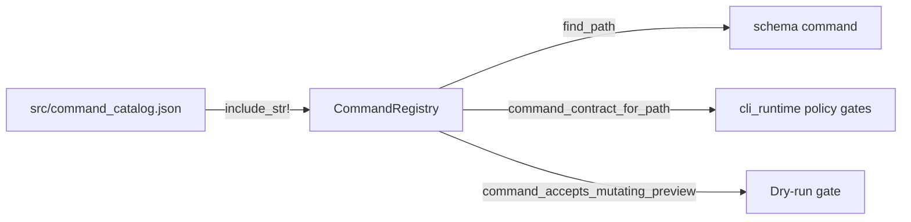

# Command registry

Active contributors: Sayo

The command registry is a typed representation of every CLI command, compiled from the embedded `src/command_catalog.json`. It powers the `schema` command and gates migration to typed in-process handlers.

## Directory layout

```
src/
├── command_registry.rs     # CommandRegistry, CommandContract, InputContract types
├── command_handlers.rs     # HandlerBinding metadata for typed dispatch migration
├── command_metadata.rs     # Normalization helpers from tool-catalog entries
└── command_context.rs      # Per-call execution context (clients, output, transport)

src/
├── command_catalog.json    # Source of truth: JSON catalog of all commands

agents/
└── error-catalog.json      # Error code reference
```

## Key abstractions

| Type | File | Description |
|------|------|-------------|
| `CommandRegistry` | `src/command_registry.rs` | In-memory registry loaded via `from_embedded_catalog()` |
| `CommandContract` | `src/command_registry.rs` | Full contract: path, aliases, group, lifecycle, risk, dry-run policy, auth, inputs |
| `Lifecycle` | `src/command_registry.rs` | `ReadOnly`, `Streaming`, `InteractiveLocal`, `LiveMutating`, `BlockedUnsupported` |
| `Risk` | `src/command_registry.rs` | `None`, `LocalState`, `LocalSecret`, `AccountState`, `FundsMovement` |
| `DryRunPolicy` | `src/command_registry.rs` | `NotSupported`, `Optional` |
| `RawPayloadPolicy` | `src/command_registry.rs` | `Unsupported`, `DryRunOnly` |
| `ConfirmationPolicy` | `src/command_registry.rs` | `None`, `Prompt` |
| `HandlerBinding` | `src/command_handlers.rs` | Purity, dispatch mode, fallback for typed handler migration |
| `InputContract` | `src/command_registry.rs` | Input argument metadata: kind, required, default, enum values |
## How it works

1. On startup, `main()` calls `CommandRegistry::load()` which reads `src/command_catalog.json` via `include_str!` (compile-time embedding)
2. Each catalog entry is converted into a `CommandContract` with normalized metadata
3. The `schema` command looks up contracts by path and renders JSON schemas for agents
4. `cli_runtime.rs` uses contracts to gate `--dry-run` and validate transport policies



## Catalog format

Each command entry in `src/command_catalog.json` has:

```json
{
  "command": "hyperliquid orders create",
  "group": "trade",
  "auth_required": true,
  "dangerous": true,
  "description": "Create a new order.",
  "args": [...],
  "lifecycle": "live_mutating",
  "risk": "funds_movement",
  "dry_run": "optional"
}
```

The `command_metadata.rs` module normalizes CLI conventions (lifecycle, risk, dry_run, confirmation) from catalog metadata into typed enums. This is the authoritative layer for input semantics when schema metadata disagrees with README prose.

## Handler bindings

`HandlerBinding` in `src/command_handlers.rs` tracks handler dispatch metadata for command contracts. The registry rollout policy in `docs/registry-rollout-policy.md` defines the checks required before command-family routing changes.

## Entry points for modification

- **Add a new command to the catalog**: edit `src/command_catalog.json`, then run `HYPERLIQUID_UPDATE_CONTRACTS=1 task contracts`
- **Add new lifecycle or risk variants**: update the enums in `src/command_registry.rs`, the normalization in `src/command_metadata.rs`, and the catalog entries
