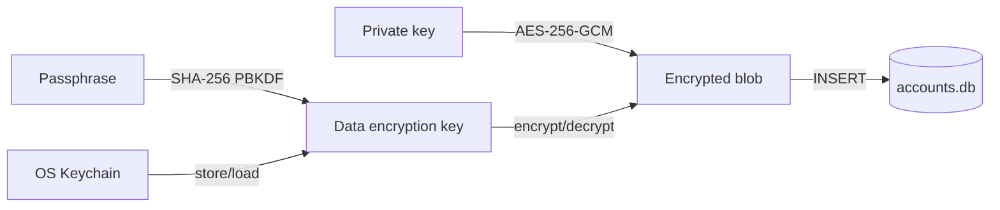

# Configuration and storage

Active contributors: Sayo

Configuration resolution, encrypted account storage, and OWS vault integration form the persistence layer for the CLI.

## Directory layout

```
src/
├── config.rs     # Config struct, Network enum, env vars, config file, API URL construction
├── db.rs         # SQLite account store with AES-256-GCM encryption
└── ows.rs        # Open Wallet Standard vault integration

~/.config/hyperliquid/
└── config.json   # User config (network, default wallet id, packaged defaults)

~/.hyperliquid/   # OWS vault directory (default, override with HYPERLIQUID_OWS_VAULT_PATH)
```

## Key abstractions

| Type | File | Description |
|------|------|-------------|
| `Config` | `src/config.rs` | User config struct (private_key, network, default_wallet_id, builder/referral defaults) |
| `Network` | `src/config.rs` | `Mainnet` or `Testnet` with case-insensitive serde |
| `AccountStore` | `src/db.rs` | SQLite-backed encrypted account storage |
| `EncryptionKeyStore` | `src/db.rs` | Trait for key material storage (OS keychain or passphrase-derived) |
| `OwsSignerConfig` | `src/ows.rs` | Resolved OWS wallet selection with address and chain account |
| `OwsWalletSelection` | `src/ows.rs` | Specific wallet id, name, and chain id from the vault |

## Config resolution priority

1. CLI flags (`--private-key`, `--testnet`, `--account`, `--ows-signer`)
2. Environment variables (`HYPERLIQUID_PRIVATE_KEY`, `HYPERLIQUID_NETWORK`, etc.)
3. Config file (`~/.config/hyperliquid/config.json`)
4. Sensible defaults (mainnet, no signer)

## Environment variables

| Variable | Purpose |
|----------|---------|
| `HYPERLIQUID_PRIVATE_KEY` | Raw private key for signing |
| `HYPERLIQUID_NETWORK` | `mainnet` or `testnet` |
| `HYPERLIQUID_API_BASE_URL` | Custom API base URL (overrides network default) |
| `HYPERLIQUID_FORMAT` | Default output format (`pretty`, `table`, `json`) |
| `HYPERLIQUID_AGENT` | Agent mode (set to `1` to default to JSON format) |
| `HYPERLIQUID_ACCOUNT_KEY_PASSPHRASE` | Passphrase-derived encryption key for account storage |
| `HYPERLIQUID_ACCOUNT_KEYCHAIN_DISABLED` | Set to `1` to disable OS keychain |
| `OWS_PASSPHRASE` | Passphrase to unlock encrypted OWS wallet |
| `HYPERLIQUID_OWS_VAULT_PATH` | Custom OWS vault path (default: `~/.hyperliquid`) |
| `HYPERLIQUID_WATCH_MAX_TICKS` | Default max ticks for snapshot watch mode |
| `HYPERLIQUID_SUBSCRIBE_MAX_EVENTS` | Default max events for WebSocket subscribe commands |
| `HYPERLIQUID_ACCOUNT_KEY_STORE_DIR` | Override the file-backed account encryption key store directory |
| `HYPERLIQUID_MAINNET_API_BASE_URL` / `HYPERLIQUID_TESTNET_API_BASE_URL` | Per-network API URL overrides |

## Account storage

Accounts are stored in a SQLite database at the platform data directory (e.g., `~/.local/share/hyperliquid/accounts.db` on Linux). Private keys are encrypted with AES-256-GCM before storage:



The encryption key material is stored in the OS keychain (macOS Keychain, Linux Secret Service, Windows Credential Manager) when available. If keychain use is disabled or unavailable, the CLI falls back to file-backed key material; in headless/CI environments, `HYPERLIQUID_ACCOUNT_KEY_PASSPHRASE` provides a deterministic passphrase-derived key.

## OWS vault

The OWS (Open Wallet Standard) vault at `~/.hyperliquid` is the primary wallet backend. All wallet creation, import, listing, and signing flow through OWS. The `--ows-signer` flag selects a wallet by name, id, or `0x` address.

The CLI checks for both `eip155:999` (Hyperliquid chain) and `eip155:1` (Ethereum mainnet) accounts when resolving OWS wallets, falling back to ETH addresses when no Hyperliquid account exists.

## Entry points for modification

- **Add a new config option**: add field to `Config` in `src/config.rs`, add env var constant, wire into resolution
- **Change encryption**: modify `src/db.rs` encryption/decryption functions
- **Change OWS wallet resolution**: update `src/ows.rs` and the signer resolution path in `src/auth.rs`/`src/cli_runtime.rs`
