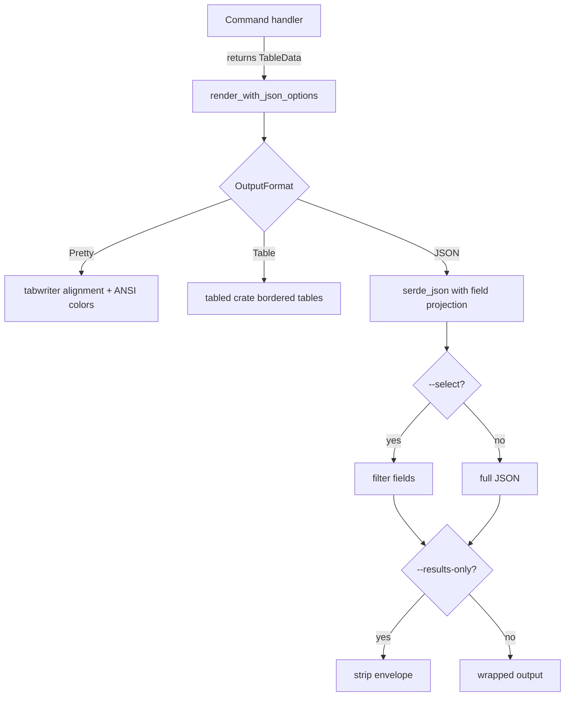

# Output rendering

Active contributors: Sayo

The output system supports three formats — pretty (colorized terminal), table (bordered), and JSON (stable snake_case) — with consistent field projection and error routing.

## Directory layout

```
src/output/
└── mod.rs    # OutputFormat enum, TableData trait, color helpers, rendering functions
```

## Key abstractions

| Type | File | Description |
|------|------|-------------|
| `OutputFormat` | `src/output/mod.rs` | `Pretty`, `Table`, `Json` — clap value enum |
| `TableData` | `src/output/mod.rs` | Trait implemented by all command output structs |
| `JsonRenderOptions` | `src/output/mod.rs` | Field selection (`--select`), envelope stripping (`--results-only`), limit (`--max-results`) |
| `colors` | `src/output/mod.rs` | ANSI color module: cyan/green/red/gray/yellow/bold helpers |

## How it works



## Color theme

| Color | Use |
|-------|-----|
| Cyan | Headers |
| Green | Positive values (profit, gains) |
| Red | Negative values (loss, declines) |
| Gray | Muted/secondary text |
| Yellow | Warnings |

In table and JSON modes, colors are disabled. Only pretty mode uses ANSI.

## Error routing

- **JSON mode**: errors on stdout as `{"error": "..."}`
- **Pretty mode**: errors on stderr with red `Error:` prefix
- **Table mode**: errors on stderr without color

Timing feedback ("Completed in X.XXs") is printed to stderr after output.

## Field projection

`--select coin,price` filters JSON output to only the named fields. Works with both top-level objects and arrays of objects. Nested field selection is not supported.

## Envelope handling

`--results-only` strips common JSON envelopes (objects with a single data key like `{"markets": [...]}`) to return bare arrays or objects. This is harmless for commands that already return bare data.

## Entry points for modification

- **Add a new format**: add variant to `OutputFormat`, implement rendering in `render_with_json_options`
- **Change color theme**: edit `src/output/mod.rs` color constants
- **Add output projection features**: extend `JsonRenderOptions` and the `render` function
