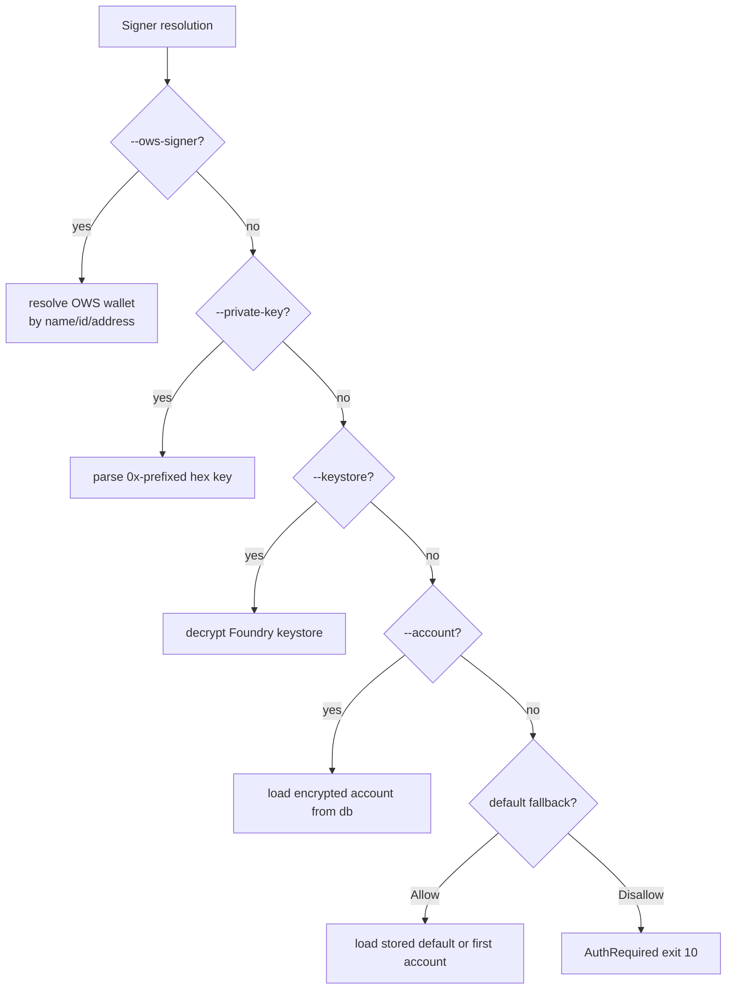
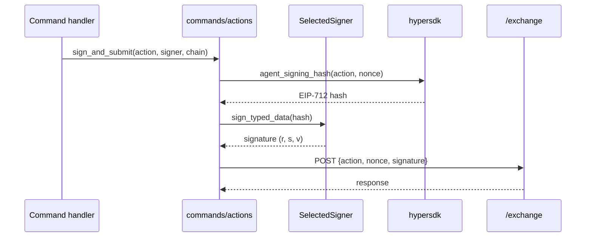

# Signing and auth

Active contributors: Sayo

Signer resolution, action signing, and authentication form the security boundary for all signed commands.

## Directory layout

```
src/
├── auth.rs         # ResolvedSigner, signer resolution, private key parsing
├── signing.rs      # SelectedSigner, SignerSource, signing backends, action signing
├── resolvers.rs    # Typed resolver APIs for signer and address selector classes
├── ows.rs          # OWS signer selection and signing
└── dry_run.rs      # Action plan previews for mutating commands
```

## Key abstractions

| Type | File | Description |
|------|------|-------------|
| `ResolvedSigner` | `src/auth.rs` | Wrapper around `SelectedSigner` providing address and key access |
| `SelectedSigner` | `src/signing.rs` | Backend-agnostic signer: local private key or OWS |
| `SignerSource` | `src/signing.rs` | `PrivateKey`, `Keystore`, `StoredAccount`, `Ows` |
| `SignerBackend` | `src/signing.rs` | `LocalPrivateKey(PrivateKeySigner)` or `Ows(OwsSigningConfig)` |
| `SignerResolverInput` | `src/resolvers.rs` | Input struct for signer resolution with fallback policy |
| `DefaultSignerFallback` | `src/resolvers.rs` | `AllowStoredDefaultOrFirst` or `Disallow` |
| `OwsSigningConfig` | `src/ows.rs` | OWS-specific signing configuration with vault path and wallet selection |

## Signer resolution chain



## Signer sources

| Source | Flag | How it works |
|--------|------|-------------|
| Raw private key | `--private-key <KEY>` | 32-byte 0x-prefixed hex string, parsed into `PrivateKeySigner` |
| Keystore | `--keystore <PATH> --keystore-password <PW>` | Foundry-compatible encrypted keystore file |
| Stored account | `--account <SELECTOR>` | Alias/id/address lookup in encrypted SQLite database |
| OWS signer | `--ows-signer <SELECTOR>` | Wallet name/id/address lookup in OWS vault |
| Environment | `HYPERLIQUID_PRIVATE_KEY` | Raw private key from environment |
| Config file | platform config directory + `/hyperliquid/config.json` | Private key read from config when present; stored accounts or OWS wallets are preferred |

## Action signing

Hyperliquid uses EIP-712 typed data signing for L1 exchange actions. The `src/commands/actions.rs` module handles:

1. Constructing the typed data payload from the action type and parameters
2. Computing the EIP-712 signing hash via `agent_signing_hash()`
3. Signing with the resolved `SelectedSigner`
4. Submitting the signed action to `/exchange` as `{action, nonce, signature, vaultAddress?}`



## Selector classes

The `resolvers.rs` module defines three selector classes for address inputs:

- **Signer selectors** (`SignerResolverInput`): resolve to a `ResolvedSigner` for signing. Accept stored accounts, OWS wallets, private keys, and keystores.
- **Public user addresses** (`ProtocolUserAddress`): resolve to a public address for info queries. Stored account aliases resolve to the master address.
- **Protocol addresses** (`RequiredProtocolAddress`): must be explicit `0x` addresses. No alias resolution — used for transfer recipients, vaults, validators.

## Dry run

`--dry-run` is gated by the command's `DryRunPolicy` in the registry. Commands with `dry_run: optional` produce a `DryRunEnvelope` showing what would be executed, the signer address, action reversibility, and live submission policy. The actual exchange action is not submitted.

## Entry points for modification

- **Add a new signer source**: add a variant to `SignerSource`, implement resolution in `auth.rs`, add to the resolution chain
- **Add a new signing scheme**: extend `SelectedSigner` with a new backend, implement `sign_typed_data`
- **Change selector semantics**: modify `resolvers.rs` resolver functions
