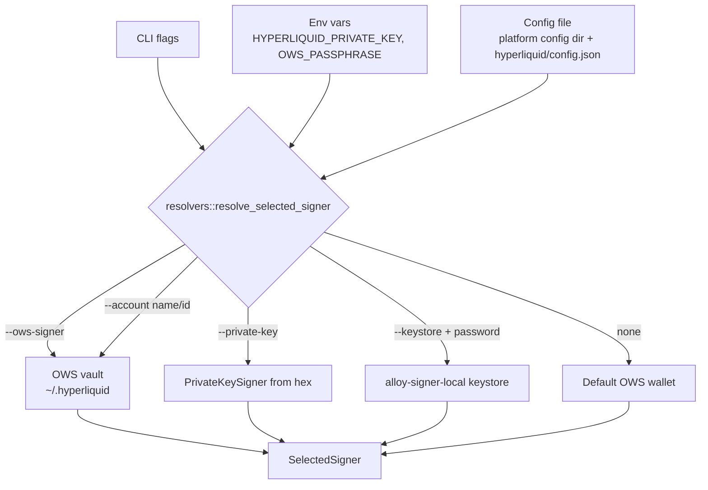

# Signing and wallets

Signer resolution converts the global flags (`--private-key`, `--keystore`, `--account`, `--ows-signer`) plus environment variables and stored config into a `SelectedSigner` that can produce EIP-712 signatures for Hyperliquid exchange actions. OWS (Open Wallet Standard) is the only stored wallet backend; explicit private key and Foundry keystore paths remain available for power users and legacy automation.

## Purpose

- One uniform `SelectedSigner` abstraction the command layer can sign with regardless of where the private key lives.
- An OWS-managed vault for human users who want lifecycle commands (create, import, list, default) without dealing with raw keys.
- Explicit non-stored signer inputs for scripts and recovery flows.

## Key files

| File | Purpose |
|------|---------|
| `src/signing.rs` | `SignerSource` enum, `SelectedSigner` over `LocalPrivateKey` and `Ows` backends. EIP-712 typed-data signing via `agent_signing_hash` and `sign_l1_action`. |
| `src/auth.rs` | `ResolvedSigner` wrapper, private-key parsing, signer resolution from any combination of flags/env/config. |
| `src/resolvers.rs` | Typed resolver inputs (`SignerResolverInput`, `DefaultSignerFallback`) that make selector classes explicit. |
| `src/ows.rs` | OWS vault path discovery, wallet selection, EIP-712 signing through `ows-lib`. |
| `src/commands/wallet.rs` | `wallet create / import / import-mnemonic / list / show / address / rename / export / delete` — all flow through OWS. |
| `src/commands/api_wallet.rs` | API/agent wallet generation and `approveAgent` flow. |

## SignerSource

```rust
#[non_exhaustive]
pub enum SignerSource {
    PrivateKey,
    Keystore,
    Ows { selector: String },
}
```

`SelectedSigner` carries the source forward so commands can attribute the resolved signer in logs and dry-run envelopes.

## Resolution precedence



When no explicit signer is specified, commands auto-detect the first OWS wallet that has a Hyperliquid (`eip155:999`) account. Direct `0x` addresses passed via `--ows-signer` require a resolved wallet for live signing; without a wallet, only identity previews are possible.

`--account`, `--ows-signer`, `--private-key`, and `--keystore` are mutually exclusive — clap rejects combinations at parse time.

## OWS vault

The OWS vault path is `~/.hyperliquid`, overridable via `HYPERLIQUID_OWS_VAULT_PATH`. Unlocking the vault uses the `OWS_PASSPHRASE` env var when set (suitable for unattended automation) and falls back to an interactive hidden prompt.

```rust
pub const HYPERLIQUID_CAIP2: &str = "eip155:999";
pub const OWS_PASSPHRASE_ENV: &str = "OWS_PASSPHRASE";
pub const OWS_VAULT_PATH_ENV: &str = "HYPERLIQUID_OWS_VAULT_PATH";
```

`OwsSignerConfig` carries the selector, derived address, and an optional `OwsWalletSelection` (wallet id, name, chain). Signing converts an Alloy `TypedData` to a Hyperliquid `Signature` through the `ows-lib` typed-data flow.

## Explicit local signers

`--private-key`, `HYPERLIQUID_PRIVATE_KEY`, config `private_key`, and `--keystore` are non-stored signer sources. They resolve to `LocalPrivateKey` inside `SelectedSigner`, then use the same command signing helpers as resolved OWS wallets. `--keystore-password` is required with `--keystore`.

## Dual Alloy 1 / Alloy 2 pinning

`hypersdk` 0.2 re-exports Alloy 1's `PrivateKeySigner`. To keep `keystore` features unified across the dependency graph, `Cargo.toml` pins both:

```toml
alloy-signer-local = { version = "2.0.4", features = ["keystore"] }
alloy-signer-local-v1 = { package = "alloy-signer-local", version = "1.8", features = ["keystore"] }
alloy-v1 = { package = "alloy", version = "1.8", features = ["signers"], default-features = false }
alloy = { version = "2.0.4", features = ["dyn-abi", "eip712", "sol-types", "signers"], default-features = false }
```

`src/lib.rs` ends with `extern crate alloy_signer_local_v1 as _;` to anchor the v1 keystore feature so the crate stays in the dependency graph. App-level EIP-712 helpers use Alloy 2; the local signer is still Alloy 1. When hypersdk moves to Alloy 2, both v1 entries can be removed. See [background/design-decisions](../background/design-decisions.md).

## Entry points for modification

- To add a new signer backend (e.g., a hardware wallet), extend `SignerBackend` in `src/signing.rs` and add a `SignerSource` variant. Update `resolvers::resolve_selected_signer` to accept the new selector.
- To change OWS vault behavior, update `src/ows.rs` and add tests under `tests/wallet_management.rs`.

See also: [features/api-wallets](../features/api-wallets.md), [reference/configuration](../reference/configuration.md), [security](../security.md).
