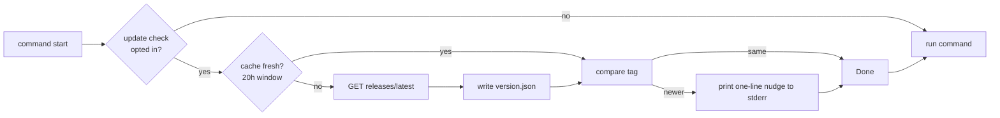

# Update and release

`hyperliquid-cli` ships as prebuilt release archives and as a `cargo install` target. The binary checks GitHub for newer releases on a slow cadence and surfaces a one-line nudge; `hyperliquid update` performs the foreground swap.

## Key files

| File | Purpose |
|------|---------|
| `src/update_check.rs` | Passive update notice, cache, foreground self-update |
| `install.sh` | Installer that downloads + verifies + places the binary |
| `.github/workflows/release.yml` | GitHub Actions packaging for Linux, macOS, Windows |
| `scripts/pre-release-check.sh` | Local-only secret/artifact gate before tagging |
| `Taskfile.yml` | `task release:check` |

## Passive update check

The runtime spawns a best-effort background check on commands that opt in. The check:

- Reads `LATEST_RELEASE_URL` (`https://api.github.com/repos/hypurrclaw/hyperliquid-cli/releases/latest`).
- Caches the latest tag for `UPDATE_CHECK_INTERVAL` (20 hours) in a `version.json` file under the config directory.
- Skips entirely when `HYPERLIQUID_NO_UPDATE_CHECK=1` or `HYPERLIQUID_AGENT=1` is set, or when stdout is not a TTY.
- Surfaces a single line to stderr if a newer release is available.



## Foreground self-update

```bash
hyperliquid update
```

Steps:

1. Resolve target platform (OS + arch).
2. Look up the matching asset URL and SHA-256 in the latest release manifest.
3. Download the archive, verify SHA-256.
4. Atomically replace the running binary with the new one.

Failure modes surface as `CliError::Unavailable` (exit 12) or `CliError::Unsupported` (exit 13). The current implementation only supports the Linux/macOS tarball assets used by `install.sh`.

## install.sh

`install.sh` mirrors the foreground update logic but for a first-time install: it picks the right asset for `uname -ms`, verifies SHA-256, and copies into `BIN_DIR` (default `~/.local/bin`). It supports:

- `HYPERLIQUID_CLI_REPO=OWNER/REPO` — alternate source repo.
- `HYPERLIQUID_CLI_VERSION=v0.11.0` — pinned version.
- `BIN_DIR=/path/to/bin` — alternate install location.
- `--json` and `--quiet` flags for unattended use.

## Release packaging

`.github/workflows/release.yml` builds and uploads:

- Linux x86_64, aarch64
- macOS x86_64, aarch64 (Intel and Apple Silicon)
- Windows x86_64

Each artifact ships with a SHA-256 checksum file. v0.11.0 specifically tightened the workflow so packaging is self-contained (see commit `da17cb8` — "ci: keep release packaging self-contained").

`scripts/pre-release-check.sh` is a local gate before tagging: it scans for accidental local-only artifacts (QA wallets, `.qa/` metadata, password files) and fails the release if anything sensitive is staged.

## Entry points for modification

- To change the update cadence: edit `UPDATE_CHECK_INTERVAL` in `src/update_check.rs`.
- To support a new platform target: add an asset selector branch in `update_check.rs` and a matching matrix entry in `.github/workflows/release.yml`.
- To change install location semantics: edit `install.sh` and refresh the README override docs.

See also: [deployment](../deployment.md), [security](../security.md).
