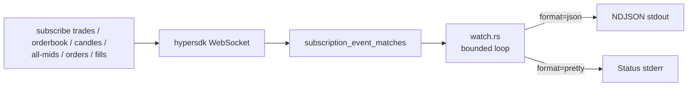

# Watch and streaming

Snapshot commands such as `mids`, `book`, and `candles` accept `--watch` to re-render in place. The `subscribe` family taps Hyperliquid's WebSocket feed for trades, order books, candles, all-mids, order updates, and fills. Both paths share the same bounding rules so agent callers never get a stream they cannot bound.

## Key files

| File | Purpose |
|------|---------|
| `src/watch.rs` | Snapshot watch loop (alternate screen via `crossterm`), WebSocket subscription helpers, NDJSON emitter |
| `src/main.rs` | `SubscribeCommands` clap definition and runtime gating |

## Snapshot watch mode

`SnapshotWatchArgs` is flattened into snapshot commands. When `--watch` is set:

- Pretty/table output: alternate screen is entered; the snapshot is re-drawn every `WATCH_REFRESH_INTERVAL` (2 s) until the user presses `q` / `Ctrl-C` or the tick cap is reached.
- JSON output: NDJSON is emitted to stdout; one JSON object per refresh.

Bounds:

- `--max-ticks N` — terminate after N refreshes.
- `HYPERLIQUID_WATCH_MAX_TICKS` — env-level cap; agents should set it as a default safety net.

The internal `WatchEvent` enum drives the loop: `Timer`, `WebSocketMessage`, `WebSocketClosed`, `KeyRefresh`, `KeyQuit`, `Continue`.

## Subscribe family

```rust
pub enum SubscribeEventKind {
    Trades,
    Orderbook,
    Candles,
    AllMids,
    OrderUpdates,
    Fills,
}
```

Each variant has a corresponding `subscribe <kind>` subcommand with its own args (asset, interval, etc.). All subscribe commands enforce:

- `--max-events N` — terminate after N events.
- `--idle-timeout-ms MS` — terminate if no event arrives within MS.
- `--format json` produces NDJSON lines; `--select` and `--max-results` are applied per line.



The runtime exposes `subscription_event_matches(event_kind, ws_event)` from `src/watch.rs` so dispatch can filter by `SubscribeEventKind`. Order updates and fills require the selected signer's user address; market-data streams are public.

## Pretty vs JSON behavior

- **Pretty/table** — status, header, and event summaries go to stderr; the alternate screen handles redraws so scrollback stays clean. Quitting restores the original terminal state via `LeaveAlternateScreen`.
- **JSON** — all events go to stdout as NDJSON. Status messages still go to stderr so JSON consumers can pipe stdout cleanly.

## Entry points for modification

- To add a new subscription kind: add a `SubscribeEventKind` variant, wire `SubscribeCommands` in `src/main.rs`, and add a routing match in `src/cli_runtime.rs`. Update `subscription_event_matches`.
- To change the refresh interval: edit `WATCH_REFRESH_INTERVAL` in `src/watch.rs`. Keep the polling cadence (`KEY_POLL_INTERVAL`) low enough that quit/refresh keys stay responsive.
- To support a new bounding flag, extend `SnapshotWatchArgs` and thread it through the watch loop's exit condition.

See also: [features/agent-output-contract](../features/agent-output-contract.md), [features/market-data](../features/market-data.md).
